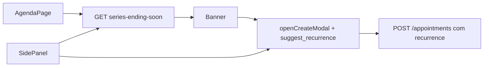

# Alerta de fim de série recorrente

## Contexto

Séries em `hub_appointment_series` são **finitas** (`until_date` ou `occurrences`, máx. 52). As ocorrências já nascem materializadas em `hub_appointments`. Hoje o front só vê `series_id` — **não** sabe se a série está acabando, e não há API nem UI de renovação.

## Decisões (v1)

- **Onde:** só na **Agenda** — banner no topo da página + alerta no painel do agendamento + botão **Renovar série**.
- **Quando alertar:** série com ocorrências futuras (não canceladas / não deletadas) em que `remaining_count <= 2` **ou** a última ocorrência futura está em até **7 dias**.
- **Renovação:** cria **nova** série via `NewAppointmentModal` (não estende a série antiga), com tutor/pet/serviços/horário pré-preenchidos e `suggest_recurrence` copiado da regra da série.
- **Fora do escopo v1:** notificação in-app, e-mail, dashboard, job cron.



## Backend

### Novo endpoint

`GET /api/hub/appointments/series-ending-soon?clinic_id=&max_remaining=2&within_days=7`

- Auth: `authenticateUser` + `requirePermission('hub.appointments.read')` (mesmo padrão de `listHubAppointments` / `getHubClinicalAlerts`).
- Registrar em [backend/src/modules/hub/routes/index.ts](backend/src/modules/hub/routes/index.ts) **junto às rotas estáticas** de appointments (antes de qualquer `/:id`), ao lado de `calendar-blocks` / `stats`.

### Lógica (novo helper ou função no controller)

Arquivo principal: [backend/src/modules/hub/hubAppointmentsController.ts](backend/src/modules/hub/hubAppointmentsController.ts) (ou serviço pequeno `hubSeriesEndingSoonService.ts` se preferir manter o controller enxuto).

1. Buscar `hub_appointments` da clínica com `series_id IS NOT NULL`, `deleted_at IS NULL`, `status != cancelled`, `starts_at >= now`.
2. Agrupar por `series_id`: `remaining_count`, `last_starts_at`, amostra do último slot (`id`, `pet_id`, `guardian_id`, `title`, `starts_at`).
3. Filtrar: `remaining_count <= max_remaining` **OU** `last_starts_at` dentro de `within_days`.
4. Join com `hub_appointment_series` para devolver regra: `kind`, `interval_value`, `days_of_week`, `day_of_month`, `until_date`, `occurrences`, `billing_mode` (se existir).
5. Resposta:

```ts
{
  series: Array<{
    series_id: string;
    remaining_count: number;
    last_starts_at: string;
    kind: string;
    interval_value: number;
    days_of_week: number[] | null;
    day_of_month: number | null;
    until_date: string | null;
    occurrences: number | null;
    sample_appointment_id: string;
    pet_id: string | null;
    guardian_id: string | null;
    title: string | null;
  }>
}
```

Defaults de query: `max_remaining=2`, `within_days=7`.

### Teste

Teste unitário/integração leve no padrão existente de appointments: série com 2 futuros entra; série com 5 futuros e última daqui a 30 dias **não** entra.

## Frontend

### API client

Em [packages/hub-ui/src/api/hubAgendaApi.ts](packages/hub-ui/src/api/hubAgendaApi.ts): tipo + `listSeriesEndingSoon({ clinic_id, max_remaining?, within_days? })`.

### Banner na Agenda

Em [packages/hub-ui/src/pages/agenda/HubAgendaPage.tsx](packages/hub-ui/src/pages/agenda/HubAgendaPage.tsx):

- Fetch ao montar / ao mudar `clinicId` / `reloadToken` (independente do range da grade).
- Banner acima da toolbar (irmão do erro de carga ~L1480), estilo informativo (não erro).
- Texto: *“A série de [título/pet] termina em breve (N restantes). Deseja renovar?”*
- Se várias séries: lista compacta (máx. 3 + “e mais X”) ou carrossel simples de itens.
- Botão **Renovar** → `openCreateModal` com:
  - `mapAgendaToAppointmentInitial` do appointment amostra (buscar no `allAppointments` ou refetch pontual se o slot não estiver no range atual);
  - `date` = dia seguinte à `last_starts_at` (ou o próprio last + intervalo);
  - `suggest_recurrence` com `kind` / `interval_value` / `occurrences` (usar `occurrences` da série original se existir, senão `remaining_count` tipicamente 4 como default do modal).

### Alerta no painel

Em [packages/hub-ui/src/pages/agenda/AppointmentSidePanel.tsx](packages/hub-ui/src/pages/agenda/AppointmentSidePanel.tsx):

- Se `appt.series_id` estiver no set de séries ending-soon (prop vinda da página ou fetch local), mostrar bloco com classe existente `hub-agenda-appt-panel__alert`.
- CTA **Renovar série** → mesmo `openCreateModal` (callback `onRenewSeries` da página).

### Prefill de renovação

Reusar [packages/hub-ui/src/pages/agenda/mapHubAgenda.ts](packages/hub-ui/src/pages/agenda/mapHubAgenda.ts) `mapAgendaToAppointmentInitial` + `suggest_recurrence` já suportado em [NewAppointmentModal.tsx](packages/hub-ui/src/pages/agenda/NewAppointmentModal.tsx) (~L634). Garantir que o modal liga “Repetir agendamento” com a regra sugerida.

### CSS

Estilo mínimo no [hub-agenda-page.css](packages/hub-ui/src/pages/agenda/hub-agenda-page.css) para o banner (ex.: `.hub-agenda__series-ending-banner`), alinhado ao visual existente do painel de alerta — sem inventar card novo.

## Critérios de aceite

- Série com 1–2 slots futuros aparece no banner e no painel ao abrir um desses slots.
- Série com última ocorrência em ≤7 dias também aparece, mesmo com `remaining_count > 2`.
- **Renovar** abre o modal de criação com dados do cliente/serviço e recorrência sugerida; ao salvar, cria série **nova** (novo `series_id`).
- Séries canceladas / sem futuros não aparecem.
- Permissão: só quem tem `hub.appointments.read` (e write para renovar, já exigido no create).
