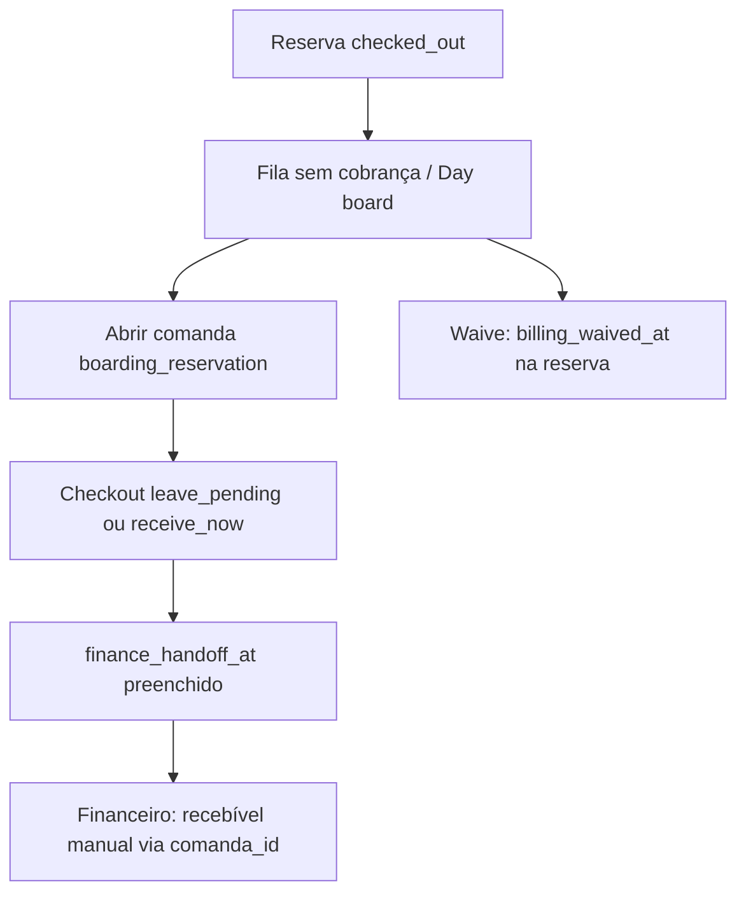

# Correção de Gaps — Hotel & Creche (Financeiro) — Plano atualizado

## O que mudou desde o plano original

Desde a criação do plano [`boarding_financial_gaps_0d6e9bb2.plan.md`](/Users/beatrizdias/.cursor/plans/boarding_financial_gaps_0d6e9bb2.plan.md), **parte substancial já foi implementada**, mas com lacunas e bugs. O contexto financeiro também evoluiu.

### Já implementado (retirar ou marcar como feito)

| Entrega | Status | Onde |
|---------|--------|------|
| Comanda a partir de reserva boarding | Feito | [`hubComandasController.ts`](backend/src/modules/hub/hubComandasController.ts) — `buildComandaItemsFromBoardingReservation` (L1054–1118), `postHubComandaOpen` (L1370–1376) |
| Tipos comanda no frontend | Feito | [`hubComandaApi.ts`](packages/hub-ui/src/api/hubComandaApi.ts) — `boarding_reservation` |
| Day board financeiro com boarding | Feito | [`hubFinancialController.ts`](backend/src/modules/hub/hubFinancialController.ts) — L2411–2458, `fetchBillingStatusBatch` com `finance_handoff_at` |
| Caixa: abrir comanda / enviar ao financeiro | Feito | [`HubCaixaPage.tsx`](packages/hub-ui/src/pages/finance/HubCaixaPage.tsx) — L174–276 |
| `collectUnbilledItems` com boarding | Parcial + bugado | [`hubFinancialController.ts`](backend/src/modules/hub/hubFinancialController.ts) — L2010–2055 |
| API capacidade por unidade | Feito (backend) | [`hubBoardingController.ts`](backend/src/modules/hub/hubBoardingController.ts) GET/PATCH `/boarding/unit-settings` |
| Migrações boarding base | Feito | README itens 51–52 — `051_create_hub_boarding_reservations.sql`, `052_create_hub_unit_boarding_settings.sql` |

### Novas regras que alteram o plano

1. **Fluxo preferencial = comanda → checkout → financeiro** ([`050b_alter_hub_comandas_finance_handoff.sql`](backend/database_migrations/petimi_hub/050b_alter_hub_comandas_finance_handoff.sql), README item **50b**):
   - Checkout `leave_pending` preenche `finance_handoff_at` → comanda bloqueada no Caixa, editável no Financeiro.
   - Recebíveis do checkout usam `source_type: 'manual'` + `comanda_id` ([`hubComandasController.ts`](backend/src/modules/hub/hubComandasController.ts) L1947–1956) — **não** `boarding_reservation:uuid`.

2. **Regra de negócio boarding** ([`HUB_BOARDING_OPERATIONAL_PLAN.md`](docs/architecture/HUB_BOARDING_OPERATIONAL_PLAN.md) Fase 5, L209):
   - Reserva `checked_out` → comanda; **nunca** criar recebível por mudança de status.
   - O caminho principal no Caixa já existe; o gap é completar waive, deduplicação e drawer.

3. **Referência README item 53 estava errada** no plano original:
   - Item 53 = `053_alter_notifications_hub_types.sql` (notificações).
   - Migration de billing boarding deve ser **novo item 56** (após item 55).

4. **Gap crítico de schema SQL não previsto no plano original**:
   - [`039_create_hub_comandas.sql`](backend/database_migrations/petimi_hub/039_create_hub_comandas.sql) CHECK de `origin_type` **não inclui** `boarding_reservation` (tem `hotel_stay`/`daycare` legados).
   - Código já insere `boarding_reservation` — **insert pode falhar no Postgres** sem migration de CHECK.

---

## Fluxo alvo (atualizado)



O caminho **recebível direto** (`POST /finance/receivables` com `boarding_reservation`) permanece necessário para paridade com grooming/encounter na fila "sem cobrança" e no waive do Caixa — mas é **secundário** ao fluxo comanda.

---

## Gaps ainda pendentes (priorizados)

### Gap A — Migration bundle (item 56 no README)

**Novo arquivo:** `backend/database_migrations/petimi_hub/057_alter_hub_boarding_reservations_billing.sql`

```sql
-- billing waive na reserva
ALTER TABLE public.hub_boarding_reservations
  ADD COLUMN IF NOT EXISTS billing_waived_at timestamptz,
  ADD COLUMN IF NOT EXISTS billing_waive_reason text;

-- CHECK origin_type em comandas (código já usa boarding_reservation)
ALTER TABLE public.hub_comandas DROP CONSTRAINT IF EXISTS hub_comandas_origin_type_check;
ALTER TABLE public.hub_comandas ADD CONSTRAINT hub_comandas_origin_type_check
  CHECK (origin_type IN (
    'appointment', 'grooming_session', 'encounter', 'quote',
    'boarding_reservation', 'hotel_stay', 'daycare', 'transport',
    'package', 'subscription', 'manual'
  ));

-- Opcional: incluir boarding_reservation em hub_receivables.source_type
-- (necessário apenas se mantiver recebível direto via POST /finance/receivables)
```

Atualizar [`README.md`](backend/database_migrations/petimi_hub/README.md) com item **56** (não 53).

---

### Gap B — Backend financeiro: enums + preview/receivable/waive

**Arquivo:** [`hubFinancialController.ts`](backend/src/modules/hub/hubFinancialController.ts)

**B1.** Adicionar `boarding_reservation` em `financeSourceTypeSchema` e `receivableSourceTypeSchema` (L10–11).

**B2.** Extrair helper compartilhado — evitar duplicação com comanda:

```ts
// Opção preferida: exportar buildComandaItemsFromBoardingReservation (ou wrapper)
// de hubComandasController e mapear items → ReceivableLineInsert
async function buildPreviewForBoardingReservation(clinicId, reservationId)
```

Reutilizar a lógica correta de diárias já em [`buildComandaItemsFromBoardingReservation`](backend/src/modules/hub/hubComandasController.ts) (L1076–1087): `checked_in_at ?? expected_check_in`, `checked_out_at ?? expected_check_out`.

**B3.** Ramos em `getHubFinancePreview`, `postHubFinanceReceivable`, `postHubFinanceWaiveBilling` — conforme plano original, validando `status === 'checked_out'` e `billing_waived_at IS NULL`.

---

### Gap C — Corrigir `collectUnbilledItems` (bugs introduzidos)

**Arquivo:** [`hubFinancialController.ts`](backend/src/modules/hub/hubFinancialController.ts) L2010–2055

Problemas atuais:

| Bug | Correção |
|-----|----------|
| `checkIn = null` hardcoded (L2034) | Selecionar `checked_in_at, expected_check_in` e usar fallback igual ao helper de comanda |
| Sem filtro `billing_waived_at` | Adicionar `.is('billing_waived_at', null)` após migration |
| Sem `.is('deleted_at', null)` | Alinhar com day board (L2420) |
| Comanda fechada + recebível manual não exclui da fila | Carregar origens com comanda não cancelada **com recebível ativo** (via `comanda_id`, espelhando `fetchBillingStatusBatch` L2165–2218) — não só `fetchOpenComandaOriginKeys` |
| Appointment duplicado quando ligado a boarding | Incluir `hub_boarding_reservations` na query `apptIdsWithOperation` (L1967–1986) |

---

### Gap D — Waive via cancelamento de comanda

**Arquivo:** [`hubComandasController.ts`](backend/src/modules/hub/hubComandasController.ts) L1845–1871

Adicionar branch:

```ts
} else if (originType === 'boarding_reservation') {
  await supabaseAdmin.from('hub_boarding_reservations')
    .update({ billing_waived_at: now, billing_waive_reason: waive_reason })
    .eq('id', originId).eq('clinic_id', clinic_id);
}
```

Sem isso, "Cancelar / sem cobrança" no Caixa para comanda de boarding não persiste waive na reserva.

---

### Gap E — Frontend: tipos e labels

**[`hubFinancialApi.ts`](packages/hub-ui/src/api/hubFinancialApi.ts)** — adicionar `'boarding_reservation'` em `HubFinanceUnbilledSourceType` (L5). Necessário para `waiveBilling` e `createReceivable` sem cast inseguro.

**[`HubFinanceiroPage.tsx`](packages/hub-ui/src/pages/finance/HubFinanceiroPage.tsx)** — adicionar em `SOURCE_TYPE_LABELS` (L64–69):

```ts
boarding_reservation: 'Hotel & Creche',
```

Nota: `LINE_KIND_LABELS` **não existe** neste arquivo — remover essa tarefa do plano original.

---

### Gap F — UI capacidade (`HubUnitEditPanel`)

**Arquivo:** [`HubUnitEditPanel.tsx`](apps/hub-web/src/components/clinic-profile/HubUnitEditPanel.tsx)

Conforme plano original:
- Carregar `hubBoardingApi.getUnitSettings(clinicId, unit.id)` ao abrir painel
- Campos `hotel_slots` e `daycare_slots_per_shift` (opcionais, NULL = sem limite)
- Salvar via `hubBoardingApi.patchUnitSettings` em paralelo ao patch da unidade

API já pronta em [`hubBoardingApi.ts`](packages/hub-ui/src/api/hubBoardingApi.ts) L175–190.

---

### Gap G — Drawer: botão "Gerar cobrança" (Fase 5 do operational plan)

**Arquivo:** [`BoardingReservationDrawer.tsx`](packages/hub-ui/src/pages/boarding/BoardingReservationDrawer.tsx)

- Prop `canManageFinance` já é passada por [`HubBoardingPage.tsx`](packages/hub-ui/src/pages/boarding/HubBoardingPage.tsx) L476, mas **não é usada** no drawer.
- Quando `status === 'checked_out'` e `canManageFinance`: botão que chama `hubComandaApi.openComanda({ origin_type: 'boarding_reservation', ... })` e navega para `/hub/caixa/comanda/:id` (espelhar padrão do Caixa day board).

---

## Arquivos a modificar (lista consolidada)

| Arquivo | Ação |
|---------|------|
| `057_alter_hub_boarding_reservations_billing.sql` | Criar (item 56) |
| `README.md` (migrations) | Item 56 |
| `hubFinancialController.ts` | Enums, preview/receivable/waive, fix collectUnbilledItems |
| `hubComandasController.ts` | Export helper + waive branch boarding |
| `hubFinancialApi.ts` | Tipo `boarding_reservation` |
| `HubFinanceiroPage.tsx` | Label SOURCE_TYPE |
| `HubUnitEditPanel.tsx` | Campos capacidade |
| `BoardingReservationDrawer.tsx` | Botão Gerar cobrança |

**Não alterar** (já ok): `HubCaixaPage.tsx`, day board boarding, `buildComandaItemsFromBoardingReservation` (só exportar se necessário).

---

## Ordem de execução

1. **Migration item 56** no Supabase (billing waive + CHECK comandas) — bloqueante
2. Backend: `hubFinancialController.ts` + waive em `hubComandasController.ts`
3. Frontend: tipos, labels, drawer, unit settings
4. QA manual: reserva checked_out → fila sem cobrança → abrir comanda → leave_pending → financeiro; waive; cancel comanda com waive

## Critérios de aceite atualizados

- Reserva `checked_out` aparece no day board e na fila "sem cobrança" com valor de diárias correto
- Após checkout comanda (`leave_pending` ou `receive_now`), reserva **some** da fila sem cobrança
- Waive pelo Caixa persiste `billing_waived_at` na reserva
- Insert de comanda `boarding_reservation` não falha no Postgres
- Drawer exibe "Gerar cobrança" para reservas finalizadas (com permissão)
- Unidade editável com vagas hotel / cães por turno creche
