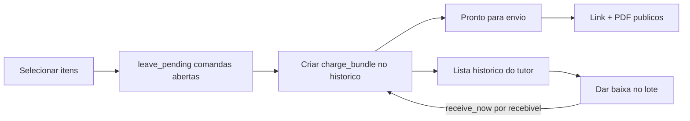

# Cobrança agrupada (PDF + link + histórico + baixa)

## Decisão de produto

- **Visual para o cliente:** um PDF e um link público com **tudo o que foi selecionado** (lista + total + vencimento).
- **Histórico:** o lote **persiste** após o envio (não é só um link descartável). Fica listado para o staff achar depois e **dar baixa nos agrupados**.
- **Baixa:** a partir do histórico do lote, abre o mesmo fluxo de «Receber agora» com os recebíveis do bundle pré-selecionados (todos ou subset). Pagamentos continuam **por recebível** (reuso da API atual); o status do lote reflete o agregado.
- Link público do lote: **somente leitura** no MVP (sem pagar online o total de uma vez).
- Pré-requisito: mesmo tutor; comandas abertas → `leave_pending` antes de entrar no lote.

## Modelo de dados

Nova migration `101_create_hub_charge_bundles.sql`:

- `hub_charge_bundles`:
  - `id`, `clinic_id`, `guardian_id`, `unit_id?`
  - `due_date?`, `public_token` (unique), `notes?`
  - `status`: `open` | `partially_paid` | `paid` | `cancelled` (derivado/atualizado ao pagar ou na leitura)
  - `total_amount` (snapshot na criação), `created_by_user_id?`, `created_at`, `sent_at?`, `cancelled_at?`
- `hub_charge_bundle_items`: `bundle_id`, `receivable_id` (unique por bundle), `sort_order`
- Saldo exibido = soma dos saldos atuais dos recebíveis do lote (PDF/link/histórico acompanham baixas parciais)

## Backend

- `POST /api/hub/finance/charge-bundles` — cria bundle + itens + token; valida mesmo tutor e recebíveis pagáveis.
- `GET /api/hub/finance/charge-bundles?clinic_id=&guardian_id=` — **histórico** (lista; filtros status).
- `GET /api/hub/finance/charge-bundles/:id` — detalhe com itens, saldos e status agregado.
- Público:
  - `GET /api/public/charge-bundles/:token`
  - `GET /api/public/charge-bundles/:token/pdf`
- Auth: `GET .../:id/pdf`
- Ao registrar pagamento em recebível que pertence a um bundle: recalcular `status` do bundle (`open` / `partially_paid` / `paid`). Hook em `postHubFinanceReceivablePayment` (e, se fizer sentido, no checkout que liquida o mesmo recebível).

## Frontend — criar e enviar

Em [`BatchChargeDrawer.tsx`](packages/hub-ui/src/pages/finance/BatchChargeDrawer.tsx):

- Ação **«Enviar cobrança»** = `leave_pending` das abertas + `createChargeBundle` + navegar para `/hub/financeiro/cobranca-lote/:bundleId/pronto-para-envio`.

Página no padrão de [`HubComandaReadyToSendPage.tsx`](packages/hub-ui/src/pages/finance/HubComandaReadyToSendPage.tsx): link/PDF/WhatsApp; marcar `sent_at` ao copiar/abrir WA (best-effort).

Rota pública `/cobranca/:token` + `HubChargeBundlePublicView`.

## Frontend — histórico e baixa

- **Perfil tutor (e pet, filtrado pelos recebíveis do pet):** seção **Cobranças enviadas** / **Lotes** na aba Financeiro — data, total, saldo em aberto, status, ações:
  - Ver / reenviar (pronto-para-envio)
  - **Dar baixa** → abre `BatchChargeDrawer` (ou drawer de recebimento) com os itens ainda pagáveis do bundle pré-selecionados
- Opcional no módulo Financeiro: lista recente de lotes da unidade (mesmo componente).
- Quando o lote fica `paid`, some da fila de pendentes e permanece no histórico como quitado (filtro «Pagos»).

## Fora deste MVP

- Um único pagamento online cobrindo o total do lote na página pública.
- E-mail automático (só WhatsApp + cópia + PDF).
- Editar composição do lote depois de criado (cancelar e criar outro, se precisar).
