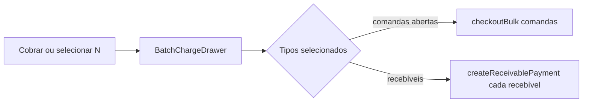

# Cobrança em conjunto (seleção + lote)

## Contexto

Hoje o **Cobrar** do resumo abre **uma** pendência. Já existe backend/API [`checkoutBulk`](packages/hub-ui/src/api/hubComandaApi.ts) (`POST /comandas/checkout-bulk`) para **comandas abertas**; recebíveis pendentes/parciais usam [`createReceivablePayment`](packages/hub-ui/src/api/hubFinancialApi.ts) um a um. O MVP une os dois tipos numa lista selecionável.

## Decisão de produto (MVP)

- **Itens:** lista unificada — (A) comandas `aberta` sem recebível cobrável; (B) recebíveis `pending` / `partially_paid`.
- **Ações no drawer:** `receive_now` (receber agora) e, só para comandas abertas selecionadas, `leave_pending` (enviar ao financeiro). Não misturar cancelamento neste fluxo.
- **Superfícies:** (1) perfil tutor/pet — botão Cobrar do resumo + CTA na aba Financeiro; (2) day board do Financeiro — multi-seleção + “Cobrar N”.
- **1 item:** mantém o fluxo atual (checkout/receivable drawer direto), sem obrigar o seletor.
- **Vários tutores no day board:** bloquear lote se os selecionados não forem do **mesmo** `guardian_id`.

## 1. Modelo de itens e helper

Criar em [`packages/hub-ui/src/pages/finance/batchChargeItems.ts`](packages/hub-ui/src/pages/finance/batchChargeItems.ts):

- Tipo `BatchChargeItem`: `{ kind: 'comanda' | 'receivable'; id; comandaId?; title; amount; dueDate?; tone; petLabel?; guardianId }`
- `buildBatchChargeItems(receivables, comandas)` — reusa [`formatReceivableListTitle`](packages/hub-ui/src/pages/finance/comandaListPreview.ts), [`formatComandaListTitle`](packages/hub-ui/src/pages/finance/comandaListPreview.ts), [`resolveDueDateTone`](packages/hub-ui/src/pages/finance/dueDateTone.ts), [`isReceivablePayable`](packages/hub-ui/src/pages/finance/comandaListPreview.ts)
- Comanda só entra se `status === 'aberta'` e não houver recebível pagável ligado a ela
- Testes unitários cobrindo dedupe, ordenação (vencidos primeiro) e exclusão de pagos

## 2. Drawer `BatchChargeDrawer`

Novo componente em [`packages/hub-ui/src/pages/finance/BatchChargeDrawer.tsx`](packages/hub-ui/src/pages/finance/BatchChargeDrawer.tsx), no padrão visual de [`ComandaCheckoutDrawer`](packages/hub-ui/src/pages/finance/ComandaCheckoutDrawer.tsx) / `HubSidePanel`:

- Lista com checkbox (selecionar todos / só vencidos)
- Total dinâmico + chips de vencimento
- Método de pagamento + (se caixa aberto) `cash_session_id` via contexto/sessão existente
- Submit:
  - Comandas → `hubComandaApi.checkoutBulk({ action, comanda_ids, payment_method, due_date?, cash_session_id? })`
  - Recebíveis → loop `createReceivablePayment` com o valor em aberto de cada um (usar `balance_amount` se existir, senão `final_amount`)
- Feedback parcial: toast com sucessos/falhas (API bulk já devolve `partial_errors`)
- `onDone` recarrega financeiro do perfil / day board

## 3. Perfil (tutor e pet)

Em [`GuardianDetailPanel.tsx`](packages/hub-ui/src/pages/clientes/GuardianDetailPanel.tsx) e [`PetDetailPanel.tsx`](packages/hub-ui/src/pages/pets/PetDetailPanel.tsx):

- Substituir `handleSummaryCharge` “pega o primeiro” por:
  - 0 itens → aba Financeiro
  - 1 item → fluxo atual (checkout ou receivable drawer)
  - 2+ → abrir `BatchChargeDrawer` com itens pré-selecionados
- Na aba Financeiro: botão **Cobrar em conjunto** (visível se ≥2 itens cobráveis), abrindo o mesmo drawer
- Após sucesso: `loadFinanceiro()` (atualiza resumo + lista)

## 4. Módulo Financeiro (day board)

Em [`FinanceDayBoardTable.tsx`](packages/hub-ui/src/pages/finance/FinanceDayBoardTable.tsx) + [`FinanceDayBoardSection.tsx`](packages/hub-ui/src/pages/finance/FinanceDayBoardSection.tsx):

- Coluna/checkbox por linha quando o item tem `comanda_id` e cobrança pendente (recebível pendente/parcial **ou** comanda aberta sem recebível quitado)
- Toolbar: “N selecionados” + **Cobrar** / limpar
- Montar `BatchChargeItem[]` a partir das linhas selecionadas; validar mesmo `guardian_id`
- Abrir o mesmo `BatchChargeDrawer`

Caixa: **fora do MVP** (continua fluxo unitário / handoff existente). O componente fica reutilizável para plugar depois.

## 5. CSS e permissões

- Estilos leves em [`hub-finance-page.css`](packages/hub-ui/src/pages/finance/hub-finance-page.css) (lista com checkbox, total sticky)
- Exigir `hub.receivables.create` para abrir/submeter; sem permissão, só “Ver financeiro”

## Ordem de entrega

1. Helper + testes  
2. `BatchChargeDrawer` + submit (bulk + pagamentos)  
3. Perfil (resumo + aba)  
4. Day board Financeiro (multi-select + toolbar)
