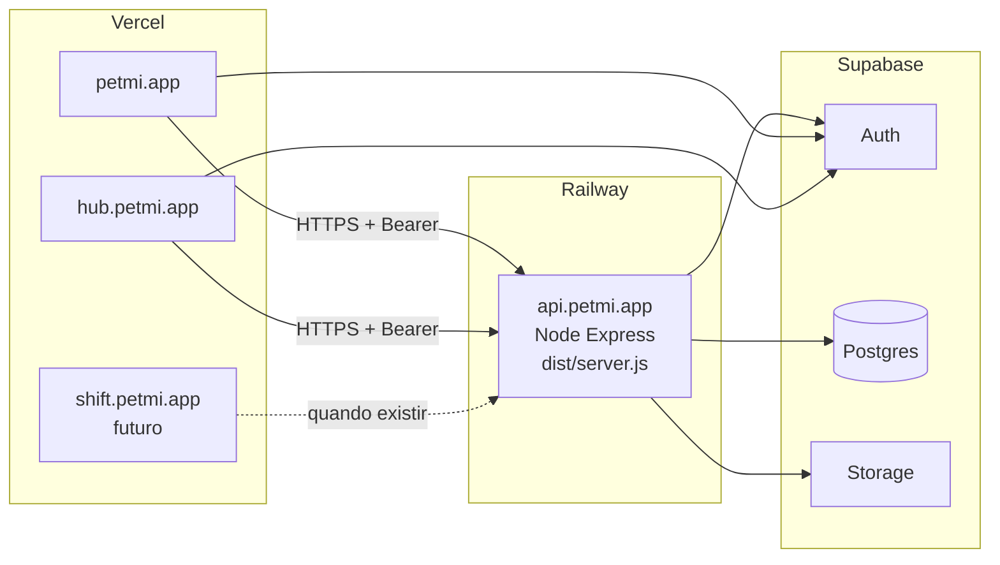

# Plano de deploy: Vercel (frontends) + Railway (API) + Supabase

## Decisão de domínios (confirmada)

| Destino | Plataforma |
|---------|------------|
| `https://petmi.app` | Vercel (PetMi Vet / site principal conforme projeto) |
| `https://hub.petmi.app` | Vercel (PetMi Hub) |
| `https://shift.petmi.app` | Futuro Vercel (app ainda fora deste monorepo) |
| `https://api.petmi.app` | Railway (Express API), **após** validação com URL temporária |
| Supabase | Auth + Postgres + Storage |

---

## Regra de ouro: Vercel serverless da API

**Não alterar, desativar nem remover** o deploy serverless do backend na Vercel (`backend/vercel.json`, `backend/api/index.js`, projeto Vercel que aponta para a API) **até** a API na Railway estar **validada em produção** (smoke tests, auth, rotas críticas, CORS com as origens reais ou temporárias).

Ordem segura:

1. Subir a API na Railway e obter a **URL temporária** (ex. `*.up.railway.app`).
2. Testar Hub/Vet (ou staging) apontando `VITE_API_URL` / `REACT_APP_API_URL` para essa URL temporária.
3. Quando estável, configurar **DNS** `api.petmi.app` → Railway e TLS.
4. Atualizar frontends para `https://api.petmi.app`.
5. **Só então** desativar o serverless da API na Vercel e, mais tarde, opcionalmente remover artefatos do repo.

Enquanto a Railway não estiver validada, o serverless na Vercel continua como **rede de segurança / rollback**.

---

## Contexto confirmado no repositório

- API: [backend/src/app.ts](backend/src/app.ts) monta Express com rotas (`/auth`, `/api/hub`, etc.) e CORS dinâmico via `PRODUCTION_ORIGINS`, `STAGING_ORIGINS`, `FRONTEND_URL` e fallbacks.
- Servidor HTTP: [backend/src/server.ts](backend/src/server.ts) usa `process.env.PORT` quando definido (compatível com Railway).
- Build API: `npm run build` em `backend/` → `tsc` → `node dist/server.js` ([backend/package.json](backend/package.json)).
- Cliente web: [packages/web-core/src/api.ts](packages/web-core/src/api.ts) usa `VITE_API_URL` / `REACT_APP_API_URL` / `EXPO_PUBLIC_API_URL` como base; fallback local `http://localhost:3000`.
- Hub: [apps/hub-web/vite.config.ts](apps/hub-web/vite.config.ts) com `envPrefix: ['VITE_', 'REACT_APP_']`; exemplo em [apps/hub-web/.env.example](apps/hub-web/.env.example).
- Backend serverless Vercel atual: [backend/vercel.json](backend/vercel.json) + [backend/api/index.js](backend/api/index.js) reexporta `dist/app.js` — **manter ativo até validação na Railway** (ver regra acima).
- Não há app “Shift” neste monorepo; `shift.petmi.app` entra no CORS e no Supabase Auth para o futuro.

---

## Fase 0 — Pré-requisitos

1. **Congelar uma release**: branch/tag alinhada ao que vai para produção.
2. **Staging primeiro** (recomendado): Railway (pode ser segundo serviço) + previews Vercel + Supabase staging ou variáveis isoladas.
3. **DNS**: `api.petmi.app` só após validação na URL temporária da Railway; apex `petmi.app` e `hub` na Vercel conforme projetos.

---

## 1. Mudanças necessárias para Railway (processo Node longo)

**O que já funciona sem alteração de código**

- `backend/` é **autossuficiente**; Railway com **Root Directory = `backend`**.
- `npm run build` / `npm start` → `dist/server.js`.
- `PORT` injetado pela Railway; [backend/src/server.ts](backend/src/server.ts) já usa `process.env.PORT`.

**Alterações de código a implementar antes do go-live na Railway** (obrigatórias pelo plano atual)

| Tema | Especificação |
|------|----------------|
| **`app.set('trust proxy', 1)`** em [backend/src/app.ts](backend/src/app.ts) | IP real do cliente atrás do proxy da Railway; necessário para `express-rate-limit` e observabilidade. |
| **`GET /health/live`** | Resposta rápida (ex. `200` + JSON `{ "status": "ok" }` ou texto fixo), **sem** chamada ao Supabase. Usar como **Healthcheck Path** na Railway. Incluir esta rota no `skip` do [backend/src/middleware/rateLimiter.ts](backend/src/middleware/rateLimiter.ts) (junto com `/` e `/health` se aplicável), para probes não consumirem quota. |
| **Winston em produção** | Em [backend/src/utils/logger.ts](backend/src/utils/logger.ts): **remover** `winston.transports.File` quando `NODE_ENV === 'production'` — apenas **Console** (stdout/stderr). A Railway lê logs pelo stream do processo; ficheiros em disco são efémeros e podem falhar. |

Opcional (não bloqueia liveness): manter `GET /` ou um `GET /health/ready` com ping ao Supabase para readiness mais profunda (separado do `/health/live`).

**Monorepo (opcional)**

- Se o backend passar a depender de pacotes na raiz: Root Directory = raiz e build apontando para `backend`. Hoje **não é obrigatório**.

---

## 2. Comandos Railway (build / start)

Root Directory = **`backend`**:

- **Install**: `npm ci` ou `npm install`.
- **Build**: `npm run build` (`tsc`).
- **Start**: `npm start` → `node dist/server.js`.

Variáveis:

- `NODE_ENV=production`
- `PORT`: deixar a Railway injetar.

**Healthcheck na UI da Railway**: método `GET`, path **`/health/live`**, esperar `200` (após implementação da rota).

Node version: alinhar com LTS (ex. 20.x) via Railway/Nixpacks ou `engines` em [backend/package.json](backend/package.json).

---

## 3. Variáveis de ambiente — backend (Railway)

| Variável | Uso |
|----------|-----|
| `SUPABASE_URL` | URL do projeto Supabase |
| `SUPABASE_ANON_KEY` | Cliente servidor com contexto de utilizador |
| `SUPABASE_SERVICE_ROLE_KEY` | **Só servidor** — nunca no frontend |
| `NODE_ENV` | `production` |
| `PORT` | Injetado pela Railway |

CORS ([backend/src/app.ts](backend/src/app.ts)):

| Variável | Uso |
|----------|-----|
| `PRODUCTION_ORIGINS` | `https://petmi.app,https://hub.petmi.app,https://shift.petmi.app` (sem `/` final) |
| `FRONTEND_URL` | Opcional extra (ex. `https://petmi.app`) |

Operação:

| Variável | Uso |
|----------|-----|
| `LOG_LEVEL` | ex. `info` |

---

## 4. Variáveis de ambiente — frontends (Vercel)

Durante validação da Railway, usar a **URL temporária** da API nas variáveis; depois trocar para `https://api.petmi.app`.

**Hub** (`apps/hub-web`): `VITE_API_URL`, `VITE_SUPABASE_URL`, `VITE_SUPABASE_ANON_KEY`, `VITE_VET_WEB_URL` → `https://petmi.app` se aplicável.

**Vet** (`frontend/`): `REACT_APP_API_URL`, Supabase anon, `REACT_APP_HUB_WEB_URL` → `https://hub.petmi.app`.

**Shift** (futuro): mesmo padrão que Hub.

**Supabase Auth**: Site URL + Redirect URLs para `https://petmi.app`, `https://hub.petmi.app`, `https://shift.petmi.app` (e paths da app).

---

## 5. CORS

`PRODUCTION_ORIGINS=https://petmi.app,https://hub.petmi.app,https://shift.petmi.app`

Incluir `www` se for usado. `credentials: true` exige correspondência exata de origem.

---

## 6. Vercel serverless da API — quando agir

- **Antes da validação da Railway**: não remover, não desativar, não alterar fluxo de deploy do serverless por segurança e rollback.
- **Depois da validação** (Railway em uso com `api.petmi.app` e frontends estáveis): desativar deploy dedicado à API na Vercel ou garantir que projetos de frontend não compilam o `backend/`.
- **Limpeza de repo** (`vercel.json` / `api/index.js` em `backend/`): apenas quando não houver dependência operacional; opcional e por último.

---

## 7. Frontends → API

1. Testes com URL Railway temporária.
2. Cutover para `https://api.petmi.app` após DNS e TLS.
3. HTTPS obrigatório.

---

## 8. Riscos de produção (resumo)

| Área | Nota |
|------|------|
| **Rate limiting** | Memória local; múltiplas réplicas → considerar Redis/Upstash. |
| **Trust proxy** | Obrigatório atrás da Railway. |
| **Uploads / PDF** | Limites de body, timeout, memória; Storage para ficheiros grandes. |
| **Service role** | Só secrets Railway. |
| **RLS** | Defesa em profundidade; service role ignora RLS — autorização na Express. |
| **Logs** | **Só stdout** em produção (este plano). |
| **Backups** | PITR/backups no painel Supabase. |
| **Health** | **`GET /health/live`** sem Supabase para a Railway; readiness com DB opcional noutro endpoint. |

---

## Sequência step-by-step (atualizada)

1. Implementar no código: **`trust proxy`**, **`GET /health/live`** (sem Supabase, fora de rate limit agressivo), **Winston só console em produção**.
2. Criar serviço **Railway** (`backend/`), envs, healthcheck → **`/health/live`**.
3. Validar com **URL temporária** da Railway (Hub/Vet ou staging com `VITE_API_URL` / `REACT_APP_API_URL` apontando para ela). **Não mexer no serverless Vercel da API.**
4. Ligar **api.petmi.app** → Railway; atualizar envs dos frontends para `https://api.petmi.app`.
5. Supabase Auth: URLs dos três domínios.
6. Monitorização; quando confortável, **desativar** serverless da API na Vercel.
7. Opcional: remover ficheiros `vercel.json` / `api/index.js` do `backend/` no repo.
8. Pós-go-live: Redis se escalar réplicas; PDF/uploads; backups.
