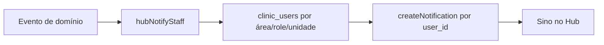

# Hub — Notificações in-app por tipo de usuário (MVP)

## Contexto

Infra **já existe** e funciona no Hub:

- Tabela `notifications` + API (`/notifications`, unread, mark read)
- Sino [`HubNotificationBell.tsx`](apps/hub-web/src/components/HubNotificationBell.tsx)
- Emissões reais hoje: `hub_pet_ready` (banho & tosa) e `unit_invitation`

O gap: cobertura operacional mínima e **broadcast amplo** (pet pronto avisa todo mundo da unidade com Hub access). Não há preferências nem página “Ver todas” no Hub (só dropdown).

**Decisão:** reusar a mesma tabela/API. Não criar `hub_notifications` paralelo nem push/WebSocket neste MVP.



## Princípio de destinatários

Priorizar **área operacional** (`clinic_users.operational_areas` / `hub_staff_members.operational_areas`), não só o role estático.

| Área / role | Recebe (MVP) |
|-------------|--------------|
| `recepcao` | Pet pronto, pet a caminho, check-in/out hotel |
| `caixa` | Pet pronto (retirada + cobrança), comanda/cancelamento pendente |
| `financeiro` | Recebível vencido / cancelamento pendente (resumo) |
| `banho_tosa` | (opcional) fila; pet pronto **não** precisa avisar groomer se já concluiu |
| `hotel_creche` | Check-in/out do dia |
| `estoque` | Item crítico / validade |
| `clinica` | Vacina a vencer (fase 1.5 se couber) |
| `CADMIN` / `CMANAGER` | Tudo crítico da unidade (ou espelho das áreas acima) |
| `CFINANCE` | Mesmo que área `financeiro` + `caixa` |

Roles `CSTAFF` / `CGROOMER` etc. entram **via áreas** atribuídas na equipe.

Escopo de unidade: filtrar staff com `default_unit_id` = unidade do evento (mesmo padrão de `notifyUnitStaffPetReady`), sem spam cross-unidade.

## 1. Helper central

Criar algo como [`backend/src/modules/hub/hubNotifyStaff.ts`](backend/src/modules/hub/hubNotifyStaff.ts):

```ts
hubNotifyStaff({
  clinicId,
  unitId?,           // opcional
  areas?: HubOperationalArea[],  // OR
  roles?: HubAccessRole[],       // OR
  type, title, message, link?, entity_type?, entity_id?,
  excludeUserIds?: string[],     // quem disparou o evento
})
```

Resolução:

1. `hub_staff_members` ativos com `has_hub_access` + `clinic_user_id` na clínica (e unidade se houver)
2. Join / lookup em `clinic_users` → `user_id`, `role`, `operational_areas`
3. Incluir se role ∈ `roles` **ou** interseção de áreas ≠ ∅
4. Sempre incluir `CADMIN` (e opcionalmente `CMANAGER`) se `includeManagers: true` (default true para eventos críticos)
5. Dedupe por `user_id`; `Promise.all` + `createNotification` (erros só log, não quebram o fluxo)

Refatorar `notifyUnitStaffPetReady` em [`hubGroomingController.ts`](backend/src/modules/hub/hubGroomingController.ts) para usar o helper com `areas: ['recepcao', 'caixa']` (em vez de todos).

## 2. Tipos novos (migration)

Nova migration `101_alter_notifications_hub_ops_types.sql` (número a confirmar no README), ampliando o CHECK de [`053_alter_notifications_hub_types.sql`](backend/database_migrations/petimi_hub/053_alter_notifications_hub_types.sql):

| Tipo | Quando | Destinatários |
|------|--------|---------------|
| `hub_pet_ready` | já existe | refinar → recepção + caixa |
| `hub_pet_on_the_way` | status leva-e-traz / “a caminho” | recepção |
| `hub_payment_due` | recebível vencido **ou** comanda aberta crítica (ver gatilho) | caixa + financeiro |
| `hub_cancellation_pending` | `cancellation_pending_at` setado | caixa + financeiro |
| `hub_stock_alert` | estoque abaixo do mínimo / validade (evento já consultável) | estoque + CADMIN |
| `hub_boarding_checkin` | check-in hotel/creche | hotel_creche + recepção |
| `hub_boarding_checkout` | check-out | hotel_creche + caixa (cobrança) |

Atualizar union em [`notificationsController.ts`](backend/src/controllers/notificationsController.ts).

**Fora do MVP:** vacina próxima (`hub_vaccine_due`), consulta do dia, preferências por usuário, push, WebSocket.

## 3. Gatilhos (onde disparar)

Ordem sugerida de wiring (baixo risco → alto valor):

1. **Pet a caminho** — ponto no controller de pickup/grooming onde o status muda para en_route / equivalente; tipo já no CHECK, só falta emitir.
2. **Pet pronto** — refinar destinatários (item 1).
3. **Cancelamento pendente** — ao setar `cancellation_pending_at` em comandas.
4. **Check-in / check-out boarding** — nos controllers de hotel já existentes.
5. **Estoque crítico** — no fluxo que já alimenta `/hub/estoque/alertas` (ou job leve no read path **evitar**; preferir write path ao ajustar quantidade).
6. **`hub_payment_due`** — MVP enxuto: ao criar recebível com `due_date` no passado, ou ao marcar parcial sem quitar; **não** varrer a base em cron neste MVP (cron = fase 2).

## 4. UI Hub

Em [`HubNotificationBell.tsx`](apps/hub-web/src/components/HubNotificationBell.tsx) + API types:

- Mapa `type → ícone/cor/label` para os novos `hub_*`
- Link “Ver todas” → página leve `/hub/notificacoes` (lista paginada, espelho enxuto do Vet — reusar `hubNotificationsApi`)
- Polling atual mantido; sem realtime

## 5. O que não fazer no MVP

- Tabela nova / inbox de “tarefas”
- Preferências ligar/desligar (fase 2: `hub_notification_prefs`)
- Notificar tutor (WhatsApp já cobre templates)
- Cron diário de vencidos / vacinas (fase 2)
- Duplicar toasts de sucesso de ação do próprio usuário como notificação persistente

## Ordem de entrega

1. Helper `hubNotifyStaff` + testes unitários da resolução de destinatários  
2. Migration de tipos + union TS  
3. Refinar `hub_pet_ready` + emitir `hub_pet_on_the_way`  
4. Financeiro: `hub_cancellation_pending` (+ `hub_payment_due` se couber no mesmo PR)  
5. Boarding check-in/out  
6. Estoque crítico  
7. UI sino + página Ver todas  

## Critério de pronto

- Usuário com só área `banho_tosa` **não** recebe aviso de estoque/financeiro  
- Recepção recebe pet pronto / a caminho  
- Caixa/financeiro recebe cancelamento pendente  
- Sino mostra ícone e navega para o módulo certo  
- Nenhuma falha de notificação quebra o fluxo de negócio (mesmo contrato de `createNotification` hoje)
