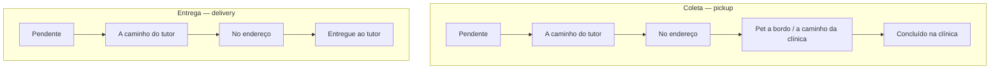
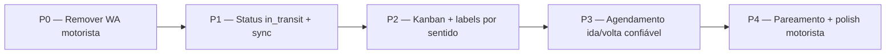

# Plano — Melhorias operacionais do Leva e Traz

## Contexto e gaps confirmados

Observado em `/hub/leva-e-traz` (ex.: card do Atum):

1. **Kanban grosso demais** — colunas `A fazer / Em rota / Concluídas` espelham status de **agendamento** (`confirmed` → `in_progress` → `done`), não o fluxo fino da **parada**.
2. **Sem “pet a bordo”** — depois de buscar o pet, o motorista não tem como marcar “já coletei, a caminho da clínica”.
3. **Só aparece coleta** — a entrega (retorno ao tutor) deveria nascer no agendamento como segunda perna; concluir a coleta **não** cria a entrega.
4. **WhatsApp “A caminho”** — texto genérico de entrega (“levar o pet até você”) e, por decisão de produto **agora**: o motorista **não** precisa mandar mensagem ao cliente.

Princípio mantido ([`HUB_PICKUP_DELIVERY_OPERATIONAL_PLAN.md`](docs/architecture/HUB_PICKUP_DELIVERY_OPERATIONAL_PLAN.md)):

> **Agendamento = intenção · Parada na rota = execução**  
> Cobrança nunca automática por mudança de status.

Decisão explícita deste plano:

| Tema | Decisão |
|------|--------|
| WhatsApp do motorista | **Fora do escopo agora** — remover CTAs do board e da visão motorista |
| Ligar para o tutor | Opcional manter (só `tel:`) |
| WhatsApp receptivo / templates | Fica para fase futura de comunicação; não bloqueia este plano |

---

## Vocabulário (evitar confusão de produto)

| Termo no Hub | Significado operacional |
|--------------|-------------------------|
| **Coleta** (`direction=pickup`) | Buscar o pet na casa → levar até a **clínica** |
| **Entrega** (`direction=delivery`) | Após o serviço, devolver o pet ao **tutor** |
| Concluir coleta | Pet **chegou na clínica** (não “criar entrega”) |
| Concluir entrega | Pet **entregue ao tutor** |

A “entrega na clínica” **não** é um card de Entrega: é o **fim da Coleta**.

---

## Fluxo alvo por sentido



### Modelo de status (parada)

Hoje em `hub_pickup_stops.status`:

`pending → en_route → arrived → completed | failed`

**Proposta:** adicionar `in_transit` (pet a bordo):

| Status | Coleta (labels UI) | Entrega (labels UI) |
|--------|--------------------|---------------------|
| `pending` | A fazer | A fazer |
| `en_route` | A caminho do tutor | A caminho do tutor |
| `arrived` | No endereço | No endereço |
| `in_transit` | **Pet a bordo · a caminho da clínica** | *(não usado — pular)* |
| `completed` | Na clínica | Entregue |
| `failed` | Falhou (+ motivo) | Falhou (+ motivo) |

Transições válidas:

```
pending → en_route | failed
en_route → arrived | failed
arrived → in_transit | completed | failed   # completed só em entrega (atalho) ou via in_transit em coleta
in_transit → completed | failed             # tipicamente só coleta
```

Regra de produto:

- **Coleta:** `arrived` → `in_transit` → `completed` (obrigatório passar por “pet a bordo”, salvo falha).
- **Entrega:** `arrived` → `completed` (sem `in_transit`).

Sincronização com `hub_appointments` (perna `pickup_route`):

| Stop | Appointment (sugestão) |
|------|-------------------------|
| `pending` | `confirmed` |
| `en_route` / `arrived` / `in_transit` | `in_progress` |
| `completed` | `done` (+ sync comanda existente) |
| `failed` | manter / `cancelled` conforme regra já usada — documentar no controller |

Pernas **soltas** (sem `hub_pickup_stops`): ao avançar no board, criar parada implícita **ou** espelhar o mesmo vocabulário só no appointment até entrar em rota. Preferência: **ao primeiro avanço operacional, materializar stop** (mesmo sem rota) *ou* operar só com appointment mapeado 1:1 aos novos estados — decidir na implementação; evitar dois mundos divergentes.

---

## Kanban alvo (recepção)

Substituir o mapeamento atual em [`PickupDayBoard.tsx`](packages/hub-ui/src/pages/pickup/PickupDayBoard.tsx) (hoje `STATUS_TO_COLUMN` em cima de status de agenda).

### Colunas propostas (4)

| Coluna | Status de parada |
|--------|------------------|
| **A fazer** | `pending` |
| **Em deslocamento** | `en_route` |
| **No local / a bordo** | `arrived`, `in_transit` |
| **Concluídas** | `completed` (+ opcional falhas em filtro separado ou pill vermelha na mesma coluna) |

Ações no card (sem WhatsApp):

- Rótulos **por `direction`** (ex.: coleta em `arrived` → botão **“Coletei · a caminho da clínica”**; entrega em `arrived` → **“Entreguei”**).
- **Detalhes** / **Agenda** permanecem.
- Remover o link **“A caminho”** (WhatsApp).

Métricas do topo: manter coletas/entregas/soltas; acrescentar contagem “a bordo” se útil.

### Pareamento coleta ↔ entrega

No board, quando houver as duas pernas do mesmo atendimento de origem (mesmo pet + mesma “janela” / vínculo explícito se existir):

- Badge ou linha “Par: retorno 15:00” / “Par: busca 12:00”.
- Link rápido entre os dois cards.

Se o vínculo hoje for só heurística temporal ([`deriveDirections`](backend/src/modules/hub/hubPickupController.ts)), avaliar gravar `origin_appointment_id` (ou equivalente) nas pernas L&T no create — **recomendado** para pareamento confiável.

---

## Visão do motorista

Arquivos: [`PickupDriverView.tsx`](packages/hub-ui/src/pages/pickup/PickupDriverView.tsx), [`PickupStopDrawer.tsx`](packages/hub-ui/src/pages/pickup/PickupStopDrawer.tsx).

- Remover botão WhatsApp.
- Manter **Ligar** (se telefone existir).
- Botão primário com label **contextual** (tabela acima).
- Destacar sentido: ↓ Coleta / ↑ Entrega.
- Próxima ação óbvia em mobile (um CTA grande).

---

## Garantir busca + retorno no agendamento

### Comportamento desejado

Ao marcar **Incluir Leva e Traz** em [`NewAppointmentModal.tsx`](packages/hub-ui/src/pages/agenda/NewAppointmentModal.tsx):

| Opção UI | Pernas criadas |
|----------|----------------|
| **Ida e volta** (default) | `before` + `after` |
| **Só busca** | só `before` |
| **Só retorno** | só `after` |

Hoje o modal **sempre** envia as duas pernas; se o board mostra só coleta, investigar:

1. Retorno em **outro dia** (filtro do day-board).
2. Falha parcial / conflito (hoje conflito em uma janela pode pular a ocorrência inteira — validar logs).
3. Agendamento editado depois sem pernas L&T (`isEditMode` não recria L&T).
4. Direção heurística errada (improvável se métrica diz `0 entregas`).

### Entregas técnicas

1. **UI:** seletor Ida e volta / Só busca / Só retorno + validação de horários.
2. **Backend:** rejeitar payload inconsistente; ao criar ida e volta, as duas inserts no mesmo fluxo (já existe loop before/after) — adicionar assert/teste: se modo round-trip, `count(pickup_route) >= 2` por ocorrência.
3. **Vínculo:** persistir referência ao agendamento principal nas duas pernas (campo novo ou `notes` estruturado — preferir coluna/`parent_appointment_id` se migration for aceitável).
4. **QA:** caso Atum — reproduzir create e conferir duas linhas em `hub_appointments` (`appointment_kind=pickup_route`).
5. **Reparação (opcional MVP+):** ação “Gerar retorno faltante” na agenda/detalhe L&T para atendimentos round-trip sem perna `after`.

**Não** criar entrega automaticamente ao concluir coleta — isso misturaria execução com intenção.

---

## Escopo por fase de implementação



| Fase | Objetivo | Release |
|------|----------|---------|
| **P0** | Tirar WhatsApp do board e da visão motorista | Imediato |
| **P1** | Migration `in_transit` + transições no `hubPickupController` + sync appointment | Base do fluxo |
| **P2** | Kanban 4 colunas + ações sem WA + drawer alinhado | Operação receptivo |
| **P3** | Modo ida/volta/só-busca/só-retorno + garantia create + investigação gap | Corrige “só coleta” |
| **P4** | Pareamento visual + labels motorista + doc | Polish |

Fora deste plano (manter no doc arquitetural como futuro):

- WhatsApp “a caminho” / templates
- GPS / tracking
- Ordenação automática por distância

---

## Arquivos principais

| Área | Arquivo |
|------|---------|
| Board | [`packages/hub-ui/src/pages/pickup/PickupDayBoard.tsx`](packages/hub-ui/src/pages/pickup/PickupDayBoard.tsx) |
| Página | [`packages/hub-ui/src/pages/pickup/HubPickupPage.tsx`](packages/hub-ui/src/pages/pickup/HubPickupPage.tsx) |
| Drawer | [`packages/hub-ui/src/pages/pickup/PickupStopDrawer.tsx`](packages/hub-ui/src/pages/pickup/PickupStopDrawer.tsx) |
| Motorista | [`packages/hub-ui/src/pages/pickup/PickupDriverView.tsx`](packages/hub-ui/src/pages/pickup/PickupDriverView.tsx) |
| API FE | [`packages/hub-ui/src/api/hubPickupApi.ts`](packages/hub-ui/src/api/hubPickupApi.ts) |
| Controller | [`backend/src/modules/hub/hubPickupController.ts`](backend/src/modules/hub/hubPickupController.ts) |
| Create L&T | [`backend/src/modules/hub/hubAppointmentsController.ts`](backend/src/modules/hub/hubAppointmentsController.ts) |
| Modal agenda | [`packages/hub-ui/src/pages/agenda/NewAppointmentModal.tsx`](packages/hub-ui/src/pages/agenda/NewAppointmentModal.tsx) |
| Migration stops | [`backend/database_migrations/petimi_hub/012c_create_hub_pickup_routes.sql`](backend/database_migrations/petimi_hub/012c_create_hub_pickup_routes.sql) → nova `08x_alter_hub_pickup_stops_in_transit.sql` |
| Doc | [`docs/architecture/HUB_PICKUP_DELIVERY_OPERATIONAL_PLAN.md`](docs/architecture/HUB_PICKUP_DELIVERY_OPERATIONAL_PLAN.md) |

---

## Critérios de aceite

- [ ] Nenhum botão WhatsApp “A caminho” no kanban nem na visão do motorista.
- [ ] Em coleta, o motorista consegue: a caminho → no endereço → **pet a bordo / a caminho da clínica** → concluído na clínica.
- [ ] Em entrega, o fluxo não exige “a caminho da clínica”; vai de no endereço → entregue.
- [ ] Labels dos botões batem com o sentido (nunca “levar” em coleta).
- [ ] Kanban reflete status operacional (não só `in_progress` genérico).
- [ ] Agendamento “Ida e volta” cria **duas** pernas `pickup_route` no mesmo dia (salvo retorno explicitamente noutro dia).
- [ ] Concluir coleta **não** inventa entrega; a entrega já existe como perna ou foi escolhido “só busca”.
- [ ] Mudança de status **não** cria recebível (regra financeira intacta).

---

## Riscos e decisões abertas

1. **Pernas soltas vs stops** — unificar na P1/P2 para o board não mentir quando `route_id` é null.
2. **Migration CHECK** — alterar constraint de `status` em `hub_pickup_stops` com cuidado em staging.
3. **`parent_appointment_id`** — vale a migration se o pareamento heurístico continuar frágil; senão, P4 fica só visual frágil.
4. **Coluna “No local / a bordo”** — misturar `arrived` + `in_transit` é ok para receptivo; motorista vê o passo fino nos botões.

---

## Próximo passo

Após aprovação: implementar na ordem **P0 → P1 → P2 → P3 → P4**, com PR pequeno por fase (P0+P1 podem ir juntos se preferir um único PR de “status operacional”).
