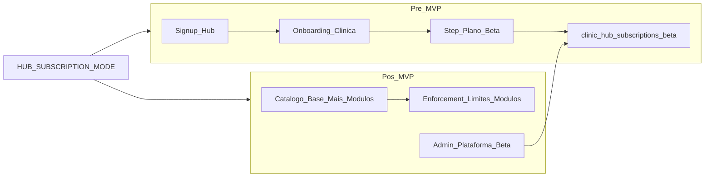

# Planos de assinatura do Hub — Beta (MVP) e catálogo pós-MVP

**Estado:** Fase 1 (pré-MVP) implementada — executar migration `082` no Supabase.

## Contexto e decisões de produto

- **Organização** = tabela `clinics` (já existente).
- **Pacotes Hub** (`hub_packages`, `hub_subscriptions`) são billing **cliente final** — não misturar com SaaS.
- Tabelas legadas `plans` / `clinic_subscriptions` ([`supabase/migrations/petivet_prod_structure.sql`](supabase/migrations/petivet_prod_structure.sql)) são do Vet, sem uso no backend — **não reutilizar**; criar schema Hub dedicado em `petimi_hub/`.
- Modelo comercial acordado:
  - **Plano base** = capacidade (unidades, usuários)
  - **Adicionais** = módulos operacionais (`clinic`, `grooming`, `boarding`)
  - **Beta** = override de cobrança + acesso total, gerenciado **somente pelo admin da plataforma** (`/admin`)



---

## Fase 1 — Pré-MVP (entregar agora)

### 1. Schema (nova migration `082_create_hub_platform_subscriptions.sql`)

Criar catálogo e assinatura por clínica:

**`hub_platform_plans`** — planos base
- `id`, `slug` (`beta`, `solo`, `growth`, `network`), `name`, `description`
- `max_units`, `max_users` (nullable = ilimitado)
- `monthly_price_cents` (nullable no MVP)
- `is_public` (boolean — `beta` = false no catálogo pós-MVP, ou true só em modo beta)
- `sort_order`, `active`

**`hub_platform_modules`** — adicionais operacionais
- `id`, `slug` (`hub_core`, `clinic`, `grooming`, `boarding`), `name`
- `monthly_price_cents` (nullable)
- `maps_to_entitlement` (text — alinha com [`PERMISSIONS_ROADMAP.md`](docs/architecture/PERMISSIONS_ROADMAP.md))

**`clinic_hub_subscriptions`** — assinatura ativa da org
- `id`, `clinic_id` → `clinics` (UNIQUE por clínica ativa)
- `base_plan_id` → `hub_platform_plans`
- `status`: `beta` | `trialing` | `active` | `past_due` | `canceled`
- `is_beta` boolean DEFAULT false
- `beta_free_until` timestamptz nullable (null = grátis até admin encerrar)
- `beta_discount_percent` smallint nullable
- `override_monthly_cents` nullable (preço customizado)
- `beta_notes` text
- `enabled_modules` text[] — módulos ativos (ex.: `['hub_core','clinic','grooming','boarding']`)
- `started_at`, `canceled_at`, `created_at`, `updated_at`

**Seed inicial:**
- Plano `beta` (max_units/users altos ou null, `is_public=true` só enquanto em modo beta)
- Módulos: `hub_core` (sempre incluso), `clinic`, `grooming`, `boarding`
- Planos `solo`, `growth`, `network` com `active=false` ou `is_public=false` até pós-MVP

### 2. Backend — serviço de assinatura

Novo módulo em [`backend/src/modules/hub/hubSubscriptionService.ts`](backend/src/modules/hub/hubSubscriptionService.ts):

- `createBetaSubscription(clinicId)` — chamado ao final do onboarding
- `getClinicSubscription(clinicId)` — leitura
- `getEnabledModules(clinicId)` — retorna array de entitlements
- `organizationHasModule(clinicId, moduleSlug)` — base para enforcement futuro
- `isSubscriptionActive(clinicId)` — beta/active/trialing contam como ativo

**Integrar em** [`hubSignupController.ts`](backend/src/modules/hub/hubSignupController.ts) → `postHubOnboardingClinic`:
- Após criar `clinics` + `units`, chamar `createBetaSubscription(clinicId)` com todos os módulos habilitados.

**Estender** [`hubSessionController.ts`](backend/src/modules/hub/hubSessionController.ts) → `getHubSessionContext`:
- Incluir no payload:
```ts
subscription: {
  status, is_beta, base_plan_slug,
  enabled_modules: string[],
  beta_free_until
}
```

**Variável de ambiente** (sem infra de feature flags hoje):
- `HUB_SUBSCRIPTION_MODE=beta_only` (default pré-MVP)
- `catalog` (pós-MVP)

**Nova rota pública/autenticada:**
- `GET /api/hub/subscription/plans` — em `beta_only`, retorna só plano Beta; em `catalog`, retorna base + módulos públicos.

### 3. Frontend Hub — step de plano no onboarding

Estender wizard em [`HubClinicOnboardingPage.tsx`](apps/hub-web/src/pages/HubClinicOnboardingPage.tsx):

| Modo | Steps |
|------|-------|
| Atual | Organização → Unidade |
| Novo | Organização → Unidade → **Plano** |

**Step Plano (beta_only):**
- Card único "Programa Beta"
- Copy: acesso completo, grátis durante o MVP, sem cartão
- Checkbox de aceite dos termos beta (opcional mas recomendado)
- Sem seleção de módulos (todos inclusos)
- `plan_slug: 'beta'` enviado no body de `POST /api/hub/onboarding/clinic` (campo novo opcional; backend ignora em beta_only e força beta)

Componentes novos em `apps/hub-web/src/components/onboarding/`:
- `HubBetaPlanCard.tsx`
- Reutilizar `HubOnboardingStepper` com 3 passos

**Session/context:** persistir `subscription` no fluxo de [`hubSessionApi.ts`](apps/hub-web/src/services/hubSessionApi.ts) → `localStorage` para uso futuro no sidebar.

### 4. Enforcement mínimo pré-MVP

**Não bloquear** funcionalidades no MVP — beta = tudo liberado.

Implementar apenas:
- Garantir que toda clínica nova tenha `clinic_hub_subscriptions`
- Backfill script/migration para clínicas existentes sem assinatura (status `beta`, todos módulos)

### 5. Admin da plataforma — gestão Beta

Estender painel existente em [`frontend/src/pages/AdminUsersPage.tsx`](frontend/src/pages/AdminUsersPage.tsx) ou criar aba em clínicas (`/admin/clinics`):

- Listar clínicas com `subscription.status`, `is_beta`, `enabled_modules`
- Formulário (somente admin plataforma):
  - Toggle `is_beta`
  - `beta_free_until` (date picker, nullable)
  - `beta_discount_percent` ou `override_monthly_cents`
  - `beta_notes`
  - `enabled_modules` (multi-select — útil para cortar acesso pontual mesmo em beta)

**API admin:** `PATCH /api/admin/clinics/:clinicId/subscription` em novo controller `adminClinicSubscriptionController.ts`.

---

## Fase 2 — Pós-MVP (implementar quando lançar catálogo)

Ativar com `HUB_SUBSCRIPTION_MODE=catalog`.

### 1. Catálogo completo no onboarding

**Step Plano** passa a ter duas seções:
1. **Plano base** — Solo / Crescimento / Rede (radio)
2. **Módulos operacionais** — Clínica, Banho & Tosa, Hotel & Creche (checkboxes; `hub_core` sempre incluso)

Pacotes sugeridos (atalhos UI, não tiers rígidos):
- Petshop → Solo + grooming
- Clínica → Solo + clinic
- Completo → Solo/Growth + todos

Preços exibidos como "a definir" ou valores de `monthly_price_cents` quando preenchidos.

### 2. Enforcement de limites e módulos

**Limites do plano base** (checar no backend, não só UI):

| Ação | Checagem |
|------|----------|
| Criar unidade | `count(units) < max_units` |
| Convidar staff | `count(clinic_users) < max_users` |
| Rotas de módulo | `organizationHasModule(clinic, 'grooming')` |

Pontos de integração:
- [`unitsController`](backend/src/controllers/unitsController.ts) — criar unidade
- [`hubStaffController.ts`](backend/src/modules/hub/hubStaffController.ts) — convite
- Middleware `requireOrgModule('grooming')` nas rotas de grooming/boarding/clinic
- [`HubSidebar.tsx`](apps/hub-web/src/components/HubSidebar.tsx) — filtrar itens: `hasPermission AND hasModule`
- [`usePermissions`](packages/web-core/src/usePermissions.ts) ou novo hook `useOrgModules`

Regra documentada: `hasPermission(user, perm) AND organizationHasModule(org, module)`.

### 3. Migração de contas Beta

Script/admin bulk:
- Clínicas com `is_beta=true` e `beta_free_until` expirado → notificar + grace period
- Admin define data de corte; após corte, status `beta` → `active` com plano escolhido ou `past_due` se sem pagamento
- **Sem gateway no primeiro release pós-MVP** — cobrança manual; campo `billing_notes` na assinatura

### 4. UI para CADMIN da clínica (somente leitura)

Página ou seção em [`HubClinicaPerfilPage.tsx`](apps/hub-web/src/pages/HubClinicaPerfilPage.tsx):
- Plano atual, módulos ativos, status beta
- CTA "Fale conosco para upgrade" (sem self-service de pagamento inicialmente)

### 5. Cobrança (fase posterior, fora do escopo imediato)

Quando preços estiverem definidos:
- Integrar Asaas/Iugu/Stripe
- Webhooks atualizam `status` (`active`, `past_due`, `canceled`)
- Não bloquear Fase 2 do catálogo por isso

---

## Mapeamento módulo → produto

| Módulo (`enabled_modules`) | Entitlement | Áreas operacionais | Sidebar |
|----------------------------|-------------|-------------------|---------|
| `hub_core` | `module.hub_core` | recepcao, caixa, financeiro | Agenda, Clientes, Caixa |
| `clinic` | `module.clinic` | clinica | Clínica |
| `grooming` | `module.grooming` | banho_tosa | Banho & Tosa |
| `boarding` | `module.boarding` | hotel_creche | Hotel & Creche |

Referência de áreas: [`packages/web-core/src/operationalAreas.ts`](packages/web-core/src/operationalAreas.ts).

---

## Arquivos principais a criar/alterar

| Área | Arquivos |
|------|----------|
| DB | `backend/database_migrations/petimi_hub/082_create_hub_platform_subscriptions.sql` |
| Backend | `hubSubscriptionService.ts`, `hubSubscriptionController.ts`, alterar `hubSignupController.ts`, `hubSessionController.ts`, `hub/routes/index.ts` |
| Admin | `adminClinicSubscriptionController.ts`, `frontend` admin UI |
| Hub Web | `HubClinicOnboardingPage.tsx`, `HubBetaPlanCard.tsx`, `hubSignupApi.ts`, `hubSessionApi.ts` |
| Pós-MVP | `HubSidebar.tsx`, `useOrgModules.ts`, middleware `requireOrgModule` |

---

## Critérios de aceite

### Fase 1 (pré-MVP)
- [ ] Novo cadastro Hub cria `clinic_hub_subscriptions` com status `beta` e todos os módulos
- [ ] Onboarding exibe step "Programa Beta" como única opção
- [ ] `GET /api/hub/session/context` retorna `subscription`
- [ ] Clínicas existentes recebem backfill beta
- [ ] Admin plataforma pode editar `is_beta`, `beta_free_until`, notas e módulos
- [ ] Nenhuma funcionalidade Hub bloqueada durante beta

### Fase 2 (pós-MVP)
- [ ] `HUB_SUBSCRIPTION_MODE=catalog` exibe Solo/Growth/Network + módulos no onboarding
- [ ] Sidebar e APIs respeitam `enabled_modules`
- [ ] Limites `max_units` / `max_users` enforced no backend
- [ ] CADMIN vê plano atual (read-only); só admin plataforma edita beta/cobrança

---

## Ordem de implementação recomendada

1. Migration + seeds
2. `hubSubscriptionService` + hook no onboarding
3. Session context + backfill
4. UI step Beta no onboarding
5. Admin plataforma para beta
6. (Pós-MVP) Catálogo, enforcement, sidebar gating
