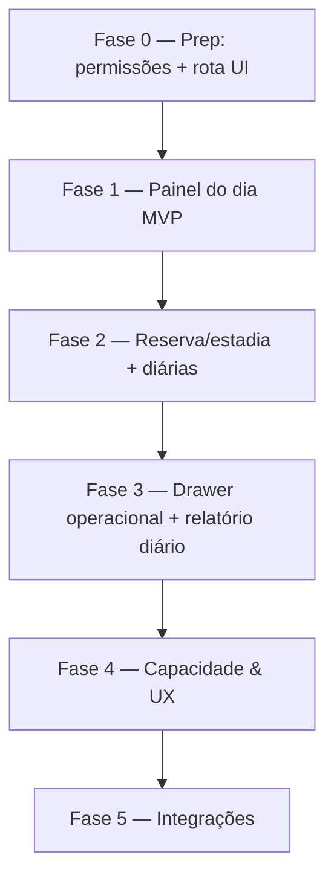

# PetMi Hub — Plano em fases: tela operacional Hotel & Creche

Plano de implementação da **operação diária de Hotel & Creche** (`/hub/hotel-creche`), alinhado ao [modelo de domínio](./HUB_DOMAIN_MODEL.md), ao plano de [Banho & Tosa](./HUB_GROOMING_OPERATIONAL_PLAN.md) (mesmos padrões de day-board, sessão e drawer) e ao [modelo financeiro](./HUB_FINANCIAL_MODEL.md).

> **Decisão de produto (jun/2026):** Hotel & Creche **permanece no MVP**. A rota `/hub/hotel-creche` hoje é `HubComingSoonPage` (`apps/hub-web/src/App.tsx`); este documento define o caminho até uma tela operacional utilizável.

---

## Estado atual (baseline)

| Item | Situação |
|------|----------|
| Rota `/hub/hotel-creche` | **Placeholder** (`HubComingSoonPage`) |
| Grupos de serviço `hotel` e `creche` | **Existem** (`hubServiceGroupsController.ts` — cores, job titles, display order) |
| `appointment_kind` `hotel_stay` / `daycare_block` | **Existem** no schema de agenda (`hubAppointmentsController.ts`) |
| Tipo de serviço `hotel_daycare` (grupo `hotel`) | Seed em `hubServiceTypesController.ts` |
| Matriz de preço por porte/período | Suportada (`hubPricingResolve.ts`, `hubServiceTypesPricingMatrix.ts` — `creche` usa período) |
| Reserva / estadia (modelo próprio) | **Não existe** (sem `hub_boarding_reservations`) |
| Permissões `boarding.*` | **Documentadas** em [PERMISSIONS_ROADMAP](./PERMISSIONS_ROADMAP.md), **ausentes** em `backend/src/utils/permissions.ts` |
| Pagamentos / comanda | Reutiliza `hub_comandas` + Financeiro (Epic 7) |

**Princípio herdado do Banho & Tosa:** *appointment = intenção; estadia/sessão = execução*. Não reaproveitar `hub_encounters` (clínico) nem `hub_grooming_sessions`; criar modelo próprio de estadia.

---

## Princípios de build

1. **Reaproveitar padrões, não tabelas:** day-board, cards, drawer lateral e filtros seguem `ClinicQueueBoard` / `GroomingQueueBoard`.
2. **Hotel ≠ Creche:** mesma tela, dois modos. Hotel = estadia multi-dia (check-in/check-out com diárias); Creche = bloco do dia (entrada/saída no mesmo dia).
3. **Cobrança nunca automática:** estadia concluída entra em **Atendimentos sem cobrança** até ação explícita «Gerar cobrança» (igual grooming/clínica). Diárias acumulam em linhas da comanda.
4. **MVP sem realtime:** polling 30s na ocupação; Supabase Realtime fica para fase de integrações.
5. **Permissões:** `boarding.reservations.manage`, `boarding.daily_report.write` (a criar em `permissions.ts`), + `hub.appointments.write` para editar a agenda subjacente.
6. **Capacidade/ocupação por unidade:** Hotel tem limite de vagas/baias; Creche tem limite de cães por turno. Configurável por unidade.

---

## Visão das fases



| Fase | Nome | Objetivo | Release utilizável |
|------|------|----------|-------------------|
| **0** | Preparação | Permissões `boarding.*`, contratos API, esqueleto UI (sai do Coming Soon) | Não (infra) |
| **1** | Painel do dia MVP | Lista de hóspedes/cães do dia a partir da agenda (`hotel`/`creche`) + status | Sim — visão operacional básica |
| **2** | Reserva/estadia | `hub_boarding_reservations` + diárias + check-in/check-out | Sim — fluxo completo de estadia |
| **3** | Drawer + relatório diário | Alimentação, medicação, passeios, observações, fotos (link), timeline | Sim — registro sem planilha |
| **4** | Capacidade & UX | Mapa de ocupação, calendário de reservas, mobile | Sim — polish |
| **5** | Integrações | Cobrança no drawer, baixa de estoque, WhatsApp template (ver [plano de comunicação](./HUB_COMMUNICATION_WHATSAPP_PLAN.md)), realtime | Incremental |

---

## Fase 0 — Preparação

**Objetivo:** desbloquear a Fase 1 e remover o placeholder.

### Entregas

1. **Permissões** em `backend/src/utils/permissions.ts`:
   - `boarding.reservations.read`, `boarding.reservations.manage`, `boarding.daily_report.write`.
   - Mapear: `CADMIN`/`CMANAGER` = manage; `CASSISTANT` = read + check-in; `CGROOMER`/`CFINANCE` conforme necessidade. Espelhar em `packages/web-core` (helpers de permissão da UI).
2. **Rotas backend** — novo grupo `/api/hub/boarding/*` em `backend/src/modules/hub/routes/index.ts` (não misturar com `encounters` nem `grooming`).
3. **Tipos compartilhados** — `packages/hub-ui/src/api/hubBoardingApi.ts` (espelhar `hubGroomingApi.ts`).
4. **Substituir placeholder** em `apps/hub-web/src/App.tsx`: rota `hotel-creche` → `HubBoardingPage` (skeleton, não Coming Soon).

### Critérios de aceite

- [ ] Usuário com `boarding.reservations.read` acessa `/hub/hotel-creche` (skeleton, não Coming Soon).
- [ ] Usuário sem permissão é redirecionado (padrão `HubClinicEncountersPage`).
- [ ] PR referencia este documento.

---

## Fase 1 — Painel do dia MVP

**Objetivo:** a recepção enxerga quem está hospedado/na creche hoje, **sem nova tabela**, usando a agenda existente.

### Backend

1. **`GET /api/hub/boarding/day-board`** — espelhar `getHubGroomingDayBoard`:
   - Filtrar agendamentos com `appointment_kind ∈ { hotel_stay, daycare_block }` **ou** tipo/linhas dos grupos `hotel` / `creche`.
   - Query: `clinic_id`, `unit_id`, `date`/`from`/`to`, `mode` (`hotel` | `creche` | `all`), `hub_staff_member_id`.
   - Resposta: `{ items, date, boarding_types_configured }`.
2. **Ações via API existente:** `PATCH /api/hub/appointments/:id` para `status` (`confirmed` → `in_progress` (check-in) → `done` (check-out)).

### Frontend (`packages/hub-ui`)

| Artefato | Base |
|----------|------|
| `HubBoardingPage.tsx` | `HubGroomingQueuePage.tsx` |
| `BoardingDayBoard.tsx` | `GroomingQueueBoard.tsx` |
| `hubBoardingApi.ts` | `hubGroomingApi.dayBoard` |

- **Abas:** «Hotel» e «Creche» (filtro `mode`).
- **Card mínimo:** pet, tutor, período (entrada→saída prevista), serviço, porte, badge de atraso de check-out.
- **Colunas (3):** Previstos hoje / Hospedados (in_progress) / Saídas de hoje.
- **Refresh:** `setInterval` 30s + botão manual.

### Critérios de aceite

- [ ] Lista só hóspedes/cães do dia da unidade selecionada (isolamento por `clinic_id`/`unit_id`).
- [ ] Check-in move o card para «Hospedados» sem reload completo.
- [ ] Banner se a clínica não tiver tipos de serviço nos grupos `hotel`/`creche`.

---

## Fase 2 — Reserva/estadia e diárias

**Objetivo:** modelo de execução próprio com controle de diárias e datas reais.

### Banco — nova migration (`create_hub_boarding_reservations.sql`)

```sql
-- Esboço conceitual (implementar no PR da Fase 2)
hub_boarding_reservations (
  id uuid PK,
  clinic_id, unit_id,
  pet_id NOT NULL,
  guardian_id,
  hub_appointment_id UNIQUE nullable,
  mode text NOT NULL,            -- 'hotel' | 'daycare'
  status text NOT NULL,          -- 'reserved' | 'checked_in' | 'checked_out' | 'cancelled' | 'no_show'
  expected_check_in, expected_check_out,
  checked_in_at, checked_out_at,
  daily_rate_cents int,          -- snapshot do preço por diária/turno
  notes text,
  created_at, updated_at, deleted_at
)

hub_boarding_daily_logs (   -- relatório diário (Fase 3)
  id, clinic_id, hub_boarding_reservation_id,
  log_date date,
  fed jsonb, medication jsonb, walks jsonb,
  mood text, notes text,
  created_by_staff_id, created_at
)
```

**Regra de diárias (hotel):** nº de diárias = noites entre `checked_in_at` e `checked_out_at` (política de virada documentada; ex.: check-out após horário-limite cobra diária extra). Creche: 1 unidade por bloco/turno.

### Backend

| Endpoint | Descrição |
|----------|-----------|
| `POST /boarding/reservations/open-from-appointment` | Idempotente; espelho `openHubGroomingSessionFromAppointment` |
| `POST /boarding/reservations` | Walk-in sem agendamento (pet + tutor obrigatórios) |
| `PATCH /boarding/reservations/:id` | `status`, datas, notas (transições validadas via Zod) |
| `GET /boarding/day-board` | Unificar agendamentos sem reserva + reservas ativas |

### Critérios de aceite

- [ ] Um agendamento gera no máximo uma reserva ativa.
- [ ] Check-out calcula nº de diárias coerente com a política documentada.
- [ ] Reserva concluída aparece em **Atendimentos sem cobrança** (nenhum `hub_receivables` criado automaticamente).
- [ ] Walk-in cria reserva sem `hub_appointment_id`.

---

## Fase 3 — Drawer operacional + relatório diário

**Objetivo:** registrar o dia a dia da estadia sem sair do painel.

### Backend

- `GET /boarding/reservations/:id/drawer` — reserva, pet, flags clínicas, tutor (telefone só exibição), diárias acumuladas, logs do dia.
- `POST /boarding/reservations/:id/daily-logs` — alimentação, medicação, passeios, humor, notas (`boarding.daily_report.write`).

### Frontend — drawer (painel direito)

1. Cabeçalho — pet, porte, tutor, telefone, período da estadia, nº de diárias até agora.
2. Relatório diário — checklist de alimentação/medicação/passeios por dia.
3. Flags do pet — `hub_pet_clinical_flags` (alergia, agressivo).
4. Observações — `notes`.
5. Timeline — eventos da estadia.

### Critérios de aceite

- [ ] Registrar alimentação/medicação do dia persiste no log e aparece na timeline.
- [ ] Flags ativas do pet aparecem no card e no drawer.
- [ ] Drawer não desmonta o painel (layout split).

---

## Fase 4 — Capacidade & UX

- **Mapa de ocupação/baias** por unidade (capacidade configurável; bloquear overbooking ou só alertar — decisão de produto).
- **Calendário de reservas** (visão semana/mês para hotel).
- **Mobile/tablet** responsivo (espelho do polish de grooming Fase 4).

### Critérios de aceite

- [ ] Tela alerta quando a ocupação prevista excede a capacidade da unidade.
- [ ] Calendário lista reservas futuras por unidade.

---

## Fase 5 — Integrações (contínuo)

| Entrega | Depende de | Notas |
|---------|------------|--------|
| Cobrança no drawer (Gerar cobrança) | [HUB_FINANCIAL_MODEL.md](./HUB_FINANCIAL_MODEL.md) | Reserva `checked_out` → comanda; nunca criar recebível por mudança de status |
| Baixa de estoque (ração, medicação) | Estoque Hub | `hub_stock_movements` com `reference_type = hub_boarding_reservation` |
| WhatsApp «pet voltando para casa» | [plano de comunicação](./HUB_COMMUNICATION_WHATSAPP_PLAN.md) | Apenas tier grátis (link `wa.me`) no MVP |
| Realtime na ocupação | Infra | Substituir polling |

---

## Critério de sucesso do módulo (release Fase 3)

A equipe de Hotel & Creche consegue, **sem planilha paralela**:

1. Ver quem está hospedado / na creche hoje.
2. Fazer check-in/check-out e contar diárias corretamente.
3. Registrar relatório diário (alimentação, medicação, passeios).
4. Consultar flags e preferências do pet no drawer.
5. Enviar a estadia para cobrança via fluxo financeiro padrão.

---

## Referências de código

| Área | Arquivo |
|------|---------|
| Padrão de fila (UI) | `packages/hub-ui/src/pages/grooming/GroomingQueueBoard.tsx` |
| Day-board grooming (backend) | `backend/src/modules/hub/hubGroomingController.ts` → `getHubGroomingDayBoard` |
| Grupos `hotel`/`creche` | `backend/src/modules/hub/hubServiceGroupsController.ts` |
| `appointment_kind` hotel/creche | `backend/src/modules/hub/hubAppointmentsController.ts` |
| Preço por porte/período | `backend/src/modules/hub/hubPricingResolve.ts` |
| Rota placeholder | `apps/hub-web/src/App.tsx` → `hotel-creche` |
| Permissões | `backend/src/utils/permissions.ts` + [PERMISSIONS_ROADMAP](./PERMISSIONS_ROADMAP.md) |

---

## Status de implementação

| Fase | Status |
|------|--------|
| 0 — Permissões + rota UI | **Concluída** (jun/2026) |
| 1 — Painel do dia MVP | **Concluída** (jun/2026) |
| 2 — Reserva/estadia + diárias | **Concluída** (jun/2026) |
| 3 — Drawer + relatório diário | **Concluída** (jun/2026) |
| 4 — Capacidade & UX | **Concluída** (jun/2026) |
| 5 — Integrações | **Concluída** (jun/2026) |

*Última atualização: jun/2026 — Todas as fases (0–5) implementadas. Executar as migrações SQL no Supabase SQL Editor em ordem: `create_hub_boarding_reservations.sql` (item 51) e `create_hub_unit_boarding_settings.sql` (item 52).*
