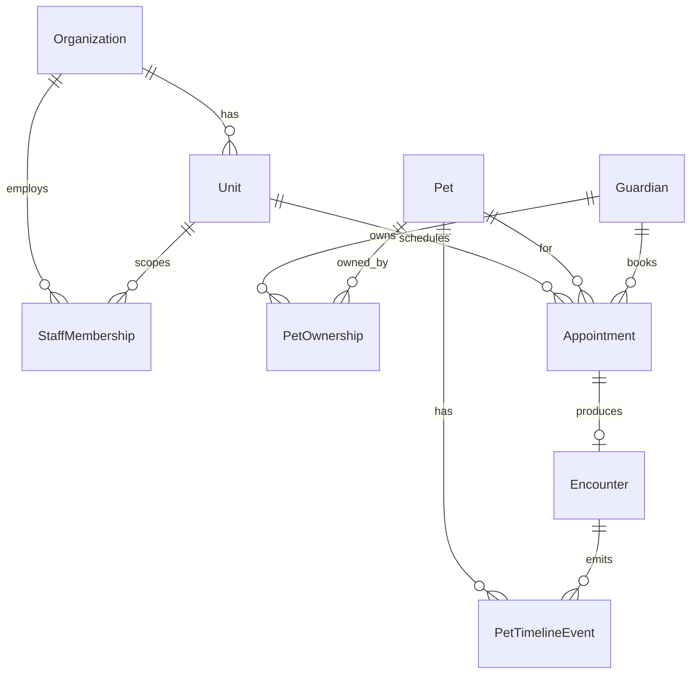

# Modelo de domínio inicial — PetMi Hub

Este documento descreve o **modelo conceitual** do PetMi Hub (Fase 1 / fundação). Ele alinha vocabulário entre produto, backend e banco, e relaciona com entidades **já existentes** no PetiMiUniverse quando aplicável.

## Objetivos do modelo

1. Um **único núcleo operacional** para clínica, banho/tosa, hotel e daycare.
2. **Multi-unidade** nativa.
3. **Pet e tutor** como cidadãos de primeira classe (integração futura total com PetMi ID).
4. **Atendimento** como unidade de trabalho do dia a dia (não confundir com “application” de staffing).

---

## Mapa conceitual

---

## Entidades

### 1. Organization (organização)

- **Significado**: o negócio pet legal/operacional (marca, CNPJ, contrato).
- **Estado atual no repo**: tabela `clinics` + fluxo de aprovação admin.
- **Evolução**: renomear mentalmente para “organization”; se no futuro existirem banho/tosa sem “clínica veterinária”, avaliar generalização de tabela ou tipo (`organization_type`).

**Dono de dados**: Hub + platform (cadastro e aprovação admin).

---

### 2. Unit (unidade)

- **Significado**: filial ou ponto físico onde ocorrem agenda e atendimentos.
- **Estado atual**: `units`, `is_main`, vínculo a `clinic_id`.

**Invariantes**

- Toda agenda e todo encounter referenciam **`unit_id`**.
- Staff pode ser restrito a unidades específicas (já parcialmente refletido em permissões por contexto).

---

### 3. Staff membership (equipe)

- **Significado**: vínculo `user` ↔ `organization` com papel e escopo de unidade.
- **Estado atual**: `clinic_users` + roles `CADMIN`, `CMANAGER`, `CASSISTANT`, `CVET_INTERNAL`.

**Evolução**

- Unificar mentalmente como `staff_memberships`; permissões granulares em `PERMISSIONS_ROADMAP.md`.

---

### 4. Guardian (tutor / responsável / cliente empresa)

- **Significado**: pessoa **ou empresa** (PJ) com quem a clínica opera no dia a dia — contato, consentimento, preferências. O **pet** é o centro emocional para o tutor; o **guardian** é o centro **operacional e financeiro** na relação clínica–cliente.
- **Persistência (Hub)**: tabela `hub_guardians` por `clinic_id`, com soft delete (`deleted_at`). Campos de perfil ampliados (migração `alter_hub_guardians_client_profile.sql`):
  - **`client_kind`**: `individual` (tutor PF) ou `company` (cliente empresa com vários pets).
  - **Identidade**: `full_name` (nome de exibição / fantasia), `legal_name` (razão social, opcional para PJ), `phone` (obrigatório na criação via API), `email`, `birth_date`, `sex` (`M`/`F`/`U`), `tax_id` (CPF/CNPJ), `id_doc_type`, `id_doc_number`, `lead_source` (origem).
  - **Endereço**: `postal_code`, `state`, `city`, `district`, `street`, `street_number`, `complement`.
  - **Operação**: `client_status` `active` | `inactive` (independente do arquivamento por `deleted_at`); notas internas em `notes`.
- **Campos típicos (visão produto)**: alinhados ao tela **Clientes** do PetMi Hub (lista + painel + cadastro PF/PJ).
- **Orçamento vs. tutor**: emitir orçamento **não** deve obrigar criar `hub_guardians` até conversão explícita; ver backlog [HUB_QUOTES_AND_PROSPECTS.md](./HUB_QUOTES_AND_PROSPECTS.md).

**Estado atual**: API `GET/POST/PATCH /api/hub/guardians`, `GET /api/hub/guardians/stats`, `GET /api/hub/guardians/:id`; UI em `@petimi/hub-ui` (`HubGuardiansPage`, `HubGuardianDetailPage`). Requer migração de perfil aplicada no Supabase para todas as colunas.

**Relação com PetMi ID**

- Guardian recebe identificador estável de plataforma; pode ou não ter `auth.users` (tutor com app no futuro).

**Evolução para “CRM de tutor”** (sem bloquear o MVP): ver seção [Guardian como CRM operacional](#guardian-como-crm-operacional-evolução-por-fases) e [HUB_GUARDIAN_CRM_VISION.md](./HUB_GUARDIAN_CRM_VISION.md).

---

### 5. Pet

- **Significado**: animal atendido; alvo da timeline e da agenda.
- **Estado atual**: tabela/API de pets referenciada no backend; pouco ou nenhum uso no frontend.

**Relação com PetMi ID**

- `petmi_pet_id` (UUID estável) como chave de ecossistema; pode mapear 1:1 para linha `pets` interna.

**Campos típicos**: espécie, raça, sexo, data nascimento, peso, alergias resumidas, observações, status (ativo/arquivado).

---

### 6. Pet ownership / link tutor–pet (`pet_guardians`)

- **Significado**: N:N entre guardian e pet (custódia compartilhada, ex-casal, cuidador, etc.). Dados que dependem do **par** (ex.: “financeiro da Lua” vs “só emergência da Kyra”) moram na **junção**, não só no guardian.

**MVP (Fase 1 / Epic 2)** — mínimo viável

- Colunas sugeridas: `pet_id`, `guardian_id`, `organization_id`, `role` (ex.: `primary`, `secondary`), timestamps, soft delete opcional.
- Opcional no MVP: um ou dois booleanos na junção (ex.: `is_billing_contact`, `receives_notifications`) se já desbloquearem contato no check-in.

**Fase 2 (relação rica)** — alvo de produto (não tudo no primeiro release)

- `relationship_type` ou enum ampliado: `primary`, `co_guardian`, `billing`, `emergency`, `caregiver`, `dog_walker`, … (lista fechada versionada).
- Flags na junção (ou JSON estrito com schema): `can_approve_procedures`, `can_pickup_pet`, `is_emergency_contact`, `lives_with_pet`, `receives_notifications`, etc.
- **Guardian institucional** (ONG, hotel, lar): exige modelar **tipo de guardian** (PF / PJ / contato institucional) antes de misturar no mesmo registo que pessoa física — ver visão detalhada no doc de CRM.

**Invariantes**

- Um encounter referencia **um** pet; notificações podem ir para **todos** guardians com papel `primary` ou `billing` (regra a refinar quando existirem flags na junção).

---

## Guardian como CRM operacional (evolução por fases)

Documento irmão com backlog temático: [HUB_GUARDIAN_CRM_VISION.md](./HUB_GUARDIAN_CRM_VISION.md).

### Fase 1 — Fundação (alinhada a Epic 1)

Objetivo: cadastro utilizável para agenda e check-in.

| Área | Conteúdo |
|------|-----------|
| Identidade básica | Nome completo, nome social opcional, documentos opcionais (CPF/RG conforme LGPD e política da clínica) |
| Contato | Email, telefone principal; opcionalmente tabela `guardian_phones` se multi-linha for requisito cedo |
| Endereço | Opcional no primeiro tela; incluir quando “leva e traz” / região for requisito |
| Preferências leves | Canal preferido (WhatsApp / ligação / email), opt-in notificações operacionais (com registo de consentimento quando exigido) |
| O que adiar | Avatar upload, CPF obrigatório no primeiro passo, muitos campos no mesmo formulário — incrementar após CRUD estável |

### Fase 2 — Tutor “completo” operacional

| Área | Conteúdo |
|------|-----------|
| Demografia | Data de nascimento, género opcional, foto |
| Endereço completo | CEP, linha de endereço, coordenadas opcionais (distância / região de atendimento) |
| Preferências | Horários preferidos, campanhas (só com opt-in explícito) |
| Perfil para staff | Tags ou **notas internas** (não “classificação pública” do tutor sem governação); ver avisos LGPD no doc de visão |

### Fase 3 — Pet rico + timeline

- Perfil comportamental do pet (JSON validado ou tabela dedicada), resumo de saúde; detalhe clínico profundo no módulo **Clinic** e consentimentos.
- Timeline (`pet_timeline_events`) como feed de leitura rápida; tipos de evento a crescer com os módulos.

### Fase 4 — CRM tutor + “família do pet” + ecossistema

- Painel tipo CRM: pets vinculados, próximos agendamentos, notas internas, agregações financeiras quando `hub_payments` for maduro.
- “Família estendida”: parceiros preferidos, veterinário de referência, etc. — entidades ligadas ou **PetMi ID**; billing pesado (cartão tokenizado, etc.) em **platform**, conforme fronteira na seção *Payment / invoice* no mesmo documento.

---

### 7. Service type (tipo de serviço)

- **Significado**: catálogo do que a unidade vende (consulta, banho, hospedagem, pacote).

**Uso**

- Classifica `Appointment` e influencia extensões (Clinic, Grooming, Hotel) sem duplicar pet/tutor.

---

### 8. Appointment (agenda)

- **Significado**: compromisso futuro ou slot bloqueado.
- **Campos típicos**: `unit_id`, `pet_id`, `guardian_id` (opcional se derivável), `service_type_id`, `starts_at`, `ends_at`, `status` (`scheduled`, `checked_in`, `completed`, `cancelled`, `no_show`), `staff_id` preferido.

**Invariantes**

- Appointment **não** substitui encounter: é intenção; encounter é execução.

---

### 9. Encounter (atendimento)

- **Significado**: execução real do serviço no dia.
- **Campos típicos**: `appointment_id` (nullable para walk-in), `unit_id`, `pet_id`, `checked_in_at`, `checked_out_at`, `status`, `primary_staff_id`, notas operacionais.

**Extensões por módulo** (tabelas ou JSON estrito com schema)

- `encounter_clinic` — sinais vitais, SOAP resumido, anexos (Fase Clinic).
- `encounter_grooming` — checklist, fotos, fila (Fase Grooming).
- `encounter_boarding` — diário, medicações (Fase Hotel).

**Invariantes**

- Um encounter pertence a **uma** unidade e **um** pet; múltiplos profissionais via tabela de participação.

**Integração com estoque (futuro)** — Quando existir API operacional de **Encounter** no Hub, baixas de consumo devem criar linhas em `hub_stock_movements` com `movement_type = encounter_out`, preenchendo `reference_type` (ex.: `hub_encounter` ou o nome estável da entidade) e `reference_id` com o identificador do encounter. O MVP de estoque já reserva estes campos no ledger; a regra de *quais* produtos entram por tipo de ato (consulta vs banho) fica para configuração de produto ou kits nessa fase.

---

### 10. Pet timeline event (evento de linha do tempo)

- **Significado**: materialização para leitura rápida do histórico (feed).

**Fontes**

- Encounters concluídos.
- Vacinas / prescrições (futuro Clinic).
- Mensagens operacionais relevantes (opcional, com cuidado de PII).

**Implementação possível**

- Tabela `pet_timeline_events` (append-only) **ou** view agregada sobre encounters + módulos; para MVP, tabela dedicada simplifica queries e permissões.

---

### 11. Payment / invoice (financeiro simples)

- **Significado**: cobrança ligada a encounter ou pacote.
- **MVP**: status (`pending`, `paid`, `refunded`), método (`pix`, `cash`, `card`), valor, referência externa opcional.

**Fronteira**: billing pesado fica em platform; linha de receita do Hub referencia `organization`/`unit`.

---

## Fluxo operacional mínimo (um dia)

1. Staff abre agenda da **unit**.
2. Cria ou confirma **appointment** para **pet** + **guardian**.
3. No dia: **check-in** → cria ou atualiza **encounter**.
4. Durante: notas, fotos, checklist (conforme módulo).
5. **check-out** → encounter `completed` → emite **timeline events** → opcional **payment** `paid`.

---

## Compatibilidade com o código atual

| Conceito Hub | Artefato atual |
|--------------|----------------|
| Organization | `clinics` |
| Unit | `units` |
| Staff | `clinic_users` |
| Pet | `pets` + controller existente |
| Guardian | a criar / alinhar schema |
| Appointment / Encounter / Timeline | a criar (migrações SQL + rotas) |
| Estoque (itens, lotes, movimentos) | `hub_inventory_*` no schema `petimi_hub`; consumo automático em encounter: ver seção Encounter |
| Equipe (cadastro operacional) | `hub_staff_members` + `hub_staff_service_types`; acesso Hub opcional; convite via `user_invitations` + `clinic_users` após aceite |

---

## Equipe no Hub (MVP)

- **Modelo**: `hub_staff_members` por `clinic_id` — nome, função obrigatórios; tipo de profissional; CRMV/UF; serviços ligados a `hub_service_types`; campos de agenda (dias, horário, intervalo, unidade, cor); `has_hub_access` + e-mail/perfil para convite.
- **Sem login**: `has_hub_access = false` e `clinic_user_id` null — continua na lista para futuros agendamentos; **não** autentica no Hub.
- **Inativo**: `active = false` — não deve aparecer para **novos** atendimentos (filtros de agenda quando existirem).
- **Próximos atendimentos**: a API devolve `next_appointments_count: 0` e `meta.next_appointments_placeholder` até existir API de agenda/compromissos no Hub.

---

## Estoque no Hub (MVP)

- **Escopo**: catálogo por `clinic_id` (produto / medicamento / vacina), fornecedores, fabricantes, lotes e movimentos em `hub_stock_movements`.
- **Código de barras**: **Fase 1 (MVP)** — campo EAN com validação no backend e leitor USB em modo teclado (focar o campo e digitalizar). **Fase 2 (opcional)** — `BarcodeDetector` no browser (Chromium) com fallback e testes em Safari/iOS quando houver prioridade de produto.

---

## Próximos passos de implementação (referência)

Detalhamento em épicos: [HUB_MVP_EPICS.md](./HUB_MVP_EPICS.md).
