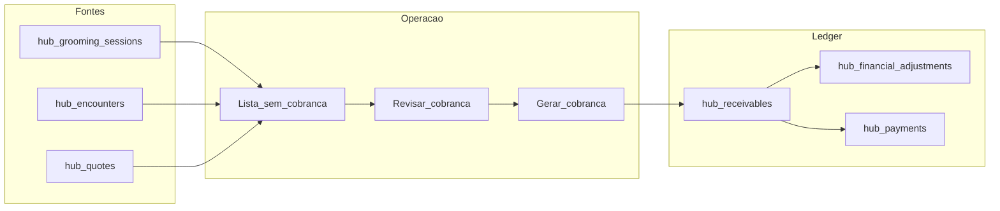

# Plano de implementação — Financeiro e Caixa (PetMi Hub)

> **Nota (mai/2026):** Fase 1: migrações 35–36. **Fase 2:** aplicar também **`create_hub_expenses.sql`** (item 37 no README de migrações).

Documento espelhado do plano aprovado. **Fonte de trabalho:** manter este ficheiro alinhado às entregas por fase.

## Fases

| Fase | Épicos | Conteúdo |
|------|--------|-----------|
| **1** | 01–03 + UI mínima | Recebíveis (criação explícita), caixa, pagamentos, lista **Atendimentos sem cobrança**, card no Caixa, `billing_state` em orçamentos, API preview/create (iterativo) |
| **2** | 04–06 | Dashboard gerencial, despesas, fluxo de caixa — **entregue (mai/2026):** migração `create_hub_expenses.sql`; API `GET /finance/dashboard-summary`, `GET /finance/cash-flow`, `GET|POST /finance/expenses`, `POST /finance/cash-sessions/:id/movements`; UI `/hub/dashboard`, separadores Despesas e Fluxo em `/hub/financeiro`, sangria/suprimento no Caixa. |
| **3** | 07 | Comissões por `hub_service_type_id` |
| **4** | 08–09 | Integrações (interface), relatórios |
| **Defer** | 10 | Centro de custos (colunas reservadas) |

## Princípios

- **Receivable** só após ação **Gerar cobrança** (sem automático em conclusão de Grooming, Encounter ou aceite de Quote).
- **Atendimentos sem cobrança:** visão obrigatória; nada concluído desaparece sem cobrança ou **waive** explícito com motivo.
- **Quote:** `accepted` ≠ cobrado; fluxo `accepted` → `awaiting_billing` → Gerar cobrança → Receivable.
- **Payment Intent:** apenas documentado em [HUB_FINANCIAL_MODEL.md](./HUB_FINANCIAL_MODEL.md) até fase de gateway.

## Diagrama resumido

## Checklist de documentação

- [HUB_FINANCIAL_MODEL.md](./HUB_FINANCIAL_MODEL.md) — modelo de domínio
- [HUB_MVP_EPICS.md](./HUB_MVP_EPICS.md) — Epic 7
- [HUB_GROOMING_OPERATIONAL_PLAN.md](./HUB_GROOMING_OPERATIONAL_PLAN.md) — Fase 5
- [HUB_QUOTES_AND_PROSPECTS.md](./HUB_QUOTES_AND_PROSPECTS.md) — faturação pós-aceite
- [PERMISSIONS_ROADMAP.md](./PERMISSIONS_ROADMAP.md)
- [backend/database_migrations/petimi_hub/README.md](../../backend/database_migrations/petimi_hub/README.md)

## Critério de pronto Fase 1 (resumo)

- Lista e contador **sem cobrança** coerentes com a API.
- Orçamento `accepted` com `billing_state` adequado e **sem** criar recebível até **Gerar cobrança** (quando o fluxo UI+POST estiver ligado).
- Permissões `hub.financial.*` e `hub.cash.*` aplicadas nas rotas.
