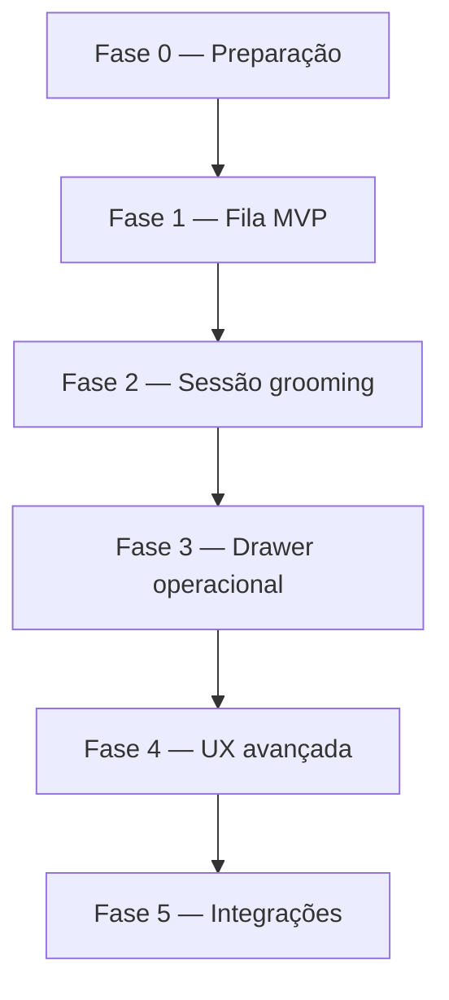

# PetMi Hub — Plano em fases: tela operacional Banho & Tosa

Plano de implementação da **fila operacional diária** de Banho & Tosa (`/hub/banho-tosa`), alinhado ao [modelo de domínio](./HUB_DOMAIN_MODEL.md), à fila clínica existente (`ClinicQueueBoard` + `GET /api/hub/encounters/day-board`) e ao requisito de produto (Kanban, drawer, poucos cliques).

**Estado atual (baseline):**

| Item | Situação |
|------|----------|
| Rota `/hub/banho-tosa` | Placeholder (`HubComingSoonPage`) |
| Agenda com grupo `banho_tosa` | Implementada (`HubAgendaPage`) |
| Fila do dia (clínica) | `hubEncountersController.getHubEncountersDayBoard` + `HubClinicEncountersPage` |
| `hub_encounters` | Modelo **clínico** (anamnese, SOAP) — **não** reutilizar para grooming |
| `encounter_grooming` | Previsto no domínio; **ainda não existe** no banco |
| Pagamentos / Realtime | Backlog ([HUB_MVP_EPICS](./HUB_MVP_EPICS.md) Epic 7) |

**Fora de escopo deste módulo:** integração WhatsApp (automática ou templates). Contato com tutor permanece apenas via telefone exibido no drawer, se cadastrado.

---

## Princípios de build

1. **Appointment = intenção; grooming session = execução** — igual à separação agenda ↔ encounter na clínica.
2. **Reaproveitar padrões**, não copiar tabelas clínicas: day-board, cards, drawer lateral, filtros de unidade/staff.
3. **Status da agenda** (`confirmed`, `in_progress`, `done`, `paid`) cobre só parte do fluxo; estágios de grooming precisam campo próprio a partir da Fase 2.
4. **MVP sem realtime**: polling 20–30s na fila; Supabase Realtime na Fase 5.
5. **Permissões** conforme [PERMISSIONS_ROADMAP](./PERMISSIONS_ROADMAP.md): `grooming.queue.read`, `grooming.queue.manage`, `grooming.media.upload`.
6. **Agenda → operacional**: agendamento entra na fila se o tipo principal **ou** qualquer linha em `hub_appointment_services` for do grupo `banho_tosa` (implementado em `GET /api/hub/grooming/day-board`).
7. **Edição na página Banho & Tosa** (check-in de sessão, checklist, adicionais, executado, avulso, notas operacionais): na UI do Hub exige **`grooming.queue.manage` e `hub.appointments.write`** (gate duplo documentado na própria página).
8. **Valores monetários (R$)** no drawer operacional: só para perfis com **`hub.service_types.write`** (gestão de catálogo/preços). Equipa de chão sem essa permissão vê nomes de serviços e adicionais, sem preços nem subtotal.
9. **Produto «Adicionais»** — persistência em `hub_grooming_session_extras`; rota HTTP mantém segmento `/extras` por compatibilidade técnica.

## Visão das fases



| Fase | Nome | Objetivo | Release utilizável |
|------|------|----------|-------------------|
| **0** | Preparação | Permissões, contratos API, esqueleto UI | Não (infra) |
| **1** | Fila MVP | Kanban do dia só com agenda + status existentes | Sim — operação básica |
| **2** | Sessão grooming | `hub_grooming_sessions` + estágios + transições | Sim — fluxo completo no chão de fábrica |
| **3** | Drawer operacional | Checklist, **adicionais**, serviços executados, timeline | Sim — registro sem burocracia |
| **4** | UX avançada | DnD, mobile, foto pet, tags estruturadas | Sim — polish |
| **5** | Integrações | Pagamento, realtime, L&T motorista | Incremental |

---

## Fase 0 — Preparação (1–2 dias)

**Objetivo:** desbloquear Fase 1 sem ambiguidade de permissões ou rotas.

### Entregas

1. **Permissões** em `packages/web-core` (ou fonte atual de permissões Hub):
   - `grooming.queue.read`
   - `grooming.queue.manage`
   - Mapear para `CASSISTANT` / `CMANAGER` / `CADMIN` (mesma regra da clínica até existir role dedicado).

2. **Rotas backend** — arquivo `backend/src/modules/hub/routes/index.ts`:
   - Grupo `/api/hub/grooming/*` (ou estender `encounters` com query `module=grooming` — **preferência: namespace `/grooming`** para não misturar com clínica).

3. **Tipos compartilhados** — `packages/hub-ui/src/api/hubGroomingApi.ts` (espelhar `hubClinicalApi.ts` / `DayBoardItem`).

4. **Substituir placeholder** em `apps/hub-web/src/App.tsx`:
   - Rota `banho-tosa` → página real em `packages/hub-ui` (ex.: `HubGroomingQueuePage`).

5. **Documentar estágios alvo** (enum fixo para Fase 2):

   | `grooming_stage` | Coluna Kanban (Fase 2+) | Descrição |
   |------------------|-------------------------|-----------|
   | `scheduled` | Confirmados | Agendado, sem check-in |
   | `checked_in` | Confirmados → Aguardando | Pet na unidade |
   | `queued` | Aguardando atendimento | Na fila interna |
   | `in_service` | Em atendimento | Banho/tosa em andamento |
   | `finishing` | Finalização | Secagem, perfume, foto, acessórios |
   | `ready` | Finalização | Pronto para tutor / entrega |
   | `delivered` | Finalizados | Entregue (incl. L&T concluído) |
   | `closed` | Finalizados | Encerrado no sistema |

### Critérios de aceite

- [ ] Usuário com `grooming.queue.read` acessa `/hub/banho-tosa` (página vazia ou skeleton, não Coming Soon).
- [ ] Usuário sem permissão é redirecionado (mesmo padrão `HubClinicEncountersPage`).
- [ ] PR referencia este documento.

### Fora de escopo

- Migrations SQL, Kanban populado.

---

## Fase 1 — Fila MVP (3–5 dias)

**Objetivo:** operação enxergar o dia de Banho & Tosa e mover pets pelos **status de agendamento** já existentes, sem nova tabela.

### Backend

1. **`GET /api/hub/grooming/day-board`**
   - Copiar lógica de `getHubEncountersDayBoard` (`hubEncountersController.ts`).
   - Filtrar agendamentos cujo `hub_service_type_id` ou linhas em `hub_appointment_services` pertençam a `service_group = 'banho_tosa'`.
   - Incluir `appointment_kind = 'pickup_route'` quando vinculado a pet do dia (badge L&T).
   - Query: `clinic_id`, `date` ou `from`/`to`, `unit_id`, `hub_staff_member_id`, opcional `status`.
   - Resposta: `{ items, date, grooming_types_configured }` (espelho de `clinical_types_configured`).

2. **Não criar** `hub_encounters` ao abrir card nesta fase (opcional: apenas PATCH `hub_appointments.status`).

3. **Ações via API existente:**
   - `PATCH /api/hub/appointments/:id` — `status`: `confirmed` → `in_progress` → `done` → `paid`.
   - Check-in = `in_progress` (mesmo semântica da agenda hoje).

### Frontend (`packages/hub-ui`)

| Artefato | Base |
|----------|------|
| `HubGroomingQueuePage.tsx` | `HubClinicEncountersPage.tsx` |
| `GroomingQueueBoard.tsx` | `ClinicQueueBoard.tsx` |
| `hubGroomingApi.ts` | `hubClinicalApi.dayBoard` |

**Colunas MVP (3)** — mapeamento direto:

| Coluna UI | Status incluídos |
|-----------|------------------|
| Agendados | `pending_confirm`, `confirmed` |
| Em atendimento | `in_progress` |
| Finalizados hoje | `done`, `paid` |

**Card mínimo:** pet, tutor, horário, serviço(s), profissional, pill de status, badge atraso (`starts_at < now` e status não terminal).

**Filtros:** unidade (persistido como agenda), profissional, busca pet/tutor.

**Refresh:** `setInterval` 30s + botão manual.

**Drawer leve:** reutilizar dados do item; link «Ver na agenda»; botões Confirmar / Check-in / Concluir / Marcar pago (mesmas regras de `AppointmentDetailPanel.buildPanelActions`).

### Critérios de aceite

- [ ] Lista só agendamentos Banho & Tosa do dia da unidade selecionada.
- [ ] Check-in move card para «Em atendimento» sem reload completo da app (refetch day-board).
- [ ] Busca por nome de pet ou tutor filtra cards.
- [ ] Banner se clínica não tiver tipos de serviço no grupo `banho_tosa` (espelho clínica sem tipos configurados).
- [x] Tablet: scroll horizontal nas 5 colunas + coluna única em mobile estreito (CSS em `grooming-page.css`; polish contínuo na Fase 4).

### Dependências

- Fase 0.
- Migrations até item 29 do [README de migrations](../../backend/database_migrations/petimi_hub/README.md) (appointments + service groups + addons).

### Fora de escopo

- `hub_grooming_sessions`, checklist, DnD, foto pet, pagamento estruturado.

---

## Fase 2 — Sessão grooming e estágios (5–8 dias)

**Objetivo:** modelo de execução próprio; Kanban com **5 colunas** alinhadas ao requisito de produto.

### Banco — nova migration

Arquivo sugerido: `create_hub_grooming_sessions.sql` (adicionar ao README migrations como item **31**).

```sql
-- Esboço conceitual (implementar no PR da Fase 2)
hub_grooming_sessions (
  id uuid PK,
  clinic_id, unit_id,
  pet_id NOT NULL,
  guardian_id,
  hub_appointment_id UNIQUE nullable,
  hub_staff_member_id,          -- responsável atual
  grooming_stage text NOT NULL, -- enum da tabela acima
  priority smallint DEFAULT 0,  -- 0 normal, >0 prioritário
  checked_in_at, started_at, ready_at, delivered_at, closed_at,
  tutor_notes_snapshot text,    -- cópia opcional de preferências no check-in
  operational_notes text,
  checklist jsonb DEFAULT '{}',
  created_at, updated_at, deleted_at
)

hub_grooming_events (
  id, clinic_id, hub_grooming_session_id,
  event_type,  -- check_in | start | pause | resume | staff_change | stage_change | note | ready | delivered
  payload jsonb,
  created_by_staff_id,
  created_at
)
```

**Regra:** ao primeiro check-in do agendamento, criar sessão (`grooming_stage = checked_in`) e opcionalmente manter `hub_appointments.status` sincronizado.

### Backend

| Endpoint | Descrição |
|----------|-----------|
| `POST /grooming/sessions/open-from-appointment` | Idempotente; espelho `openHubEncounterFromAppointment` |
| `PATCH /grooming/sessions/:id` | `grooming_stage`, `hub_staff_member_id`, `priority`, notas |
| `GET /grooming/day-board` | Unificar appointment sem sessão + sessões do dia |
| `POST /grooming/sessions/:id/events` | Append timeline |

Validação Zod: transições permitidas (máquina de estados simples; ex.: não `closed` → `in_service`).

### Frontend

**Colunas (5):**

1. Confirmados — `scheduled`, `checked_in`
2. Aguardando — `queued`
3. Em atendimento — `in_service`
4. Finalização — `finishing`, `ready`
5. Finalizados — `delivered`, `closed` (+ `done`/`paid` do agendamento no mesmo dia)

**Ações rápidas no card (sem modal):**

- Avançar estágio (botão primário contextual)
- Adicionar observação curta (inline expand ou popover)
- Alterar prioridade (toggle ou menu)

**Drawer:** abrir sessão; mostrar timeline básica (eventos da Fase 2).

### Critérios de aceite

- [ ] Um agendamento gera no máximo uma sessão ativa.
- [ ] Troca de profissional registra evento `staff_change`.
- [ ] Day-board reflete estágio em < 30s (polling).
- [ ] Walk-in: `POST /grooming/sessions` sem `hub_appointment_id` (pet + tutor obrigatórios).

### Dependências

- Fase 1 em produção ou branch estável.

---

## Fase 3 — Drawer operacional completo (5–7 dias)

**Objetivo:** registrar serviços, **adicionais** (produto; tabela `hub_grooming_session_extras`), checklist e preferências do tutor sem sair do Kanban.

### Banco

- `hub_appointment_services.executed_at`, `executed_by_staff_id` (Fase 3).
- `hub_grooming_session_extras` — linhas de **adicionais** na sessão (snapshot de nome/preço para histórico).
- `hub_grooming_checklist_templates` — por clínica/unidade, JSON array de itens `{ key, label, default_checked }` (opcional; padrão no backend).

### Backend

- `GET/PATCH` checklist da sessão — checklist em `hub_grooming_sessions.checklist` (merge por chave); itens padrão em `groomingChecklistDefaults.ts`; opcional `hub_grooming_checklist_templates`.
- `GET /grooming/sessions/:id/drawer` — sessão, pet, flags/tags, última visita encerrada, linhas do agendamento (grooming), **adicionais** já registados, catálogo de addons disponíveis, checklist mesclado.
- `POST /grooming/sessions/:id/extras` — adicionar serviço `is_addon` (valida `hub_service_type_addon_availability` / grupo `banho_tosa`). *Segmento `/extras` é técnico; na UI e documentação de produto usar «Adicionais».*
- `PATCH /grooming/appointment-service-lines/:lineId` — `executed_at` / `executed_by_staff_id` nas linhas do agendamento.
- `PATCH /grooming/sessions/:id` — aceita também `checklist` (além de estágio, prioridade, notas).

### Modelo de API (manutenção)

- O contexto operacional agregado (pet, flags, última visita, linhas de grooming, adicionais, addons disponíveis, checklist) é servido por **`GET /grooming/sessions/:id/drawer`**, num único round-trip. Mantém uma única implementação em `hubGroomingDrawerController` e evita drift entre vários endpoints.
- **Não** há `GET /pets/:id/grooming-context` no MVP. Se outra superfície precisar do mesmo pacote **sem** sessão, o passo recomendado é extrair funções compartilhadas no backend e só depois expor um endpoint por `pet_id` (evitar copiar queries).

### Frontend — drawer (painel direito)

Seções (ordem do requisito):

1. Cabeçalho — pet, idade, porte, tutor, telefone (somente exibição), última visita
2. Serviços agendados — toggle executado quando existem linhas `hub_appointment_services` de grooming; caso contrário texto de alinhamento com a Agenda (somente leitura)
3. **Adicionais** — combobox de addons do grupo `banho_tosa` (preços e subtotal só com `hub.service_types.write`)
4. Checklist — template da clínica
5. Observações do tutor — read-only destacado (`notes` + flags)
6. Notas do atendimento — `operational_notes`
7. Timeline — `hub_grooming_events`

### Tags visuais (estruturadas)

| Tag | Fonte |
|-----|--------|
| Alergia | `hub_pet_clinical_flags.flag_key = allergy` |
| Reativo / agressivo | `aggressive` |
| Leva e traz | `appointment_kind` ou pickup no agendamento |
| Sem secador / preferências | `hub_pets.notes` (parse ou campo futuro `preferences jsonb`) |

**Primeira visita:** badge no day-board quando o pet ainda não tem sessão encerrada (`closed_at` preenchido) na clínica — ver Fase 4. «Tutor exigente» continua adiado (sem fonte estruturada).

### Critérios de aceite

- [x] Marcar «unhas cortadas» persiste no checklist da sessão.
- [x] Adicionar **adicional** atualiza o subtotal de referência quando o utilizador tem permissão para ver preços (`hub.service_types.write`).
- [x] Flags ativas aparecem no card e no drawer.
- [x] Drawer não desmonta o Kanban (layout split).

**Nota:** contexto de grooming por pet foi concentrado em `GET /grooming/sessions/:id/drawer` (ver «Modelo de API» acima).

### Dependências

- Fase 2.
- Migrations addons (itens 27–29 do README).

---

## Fase 4 — UX avançada (4–6 dias) — **concluída** (sem upload de foto de pet)

**Objetivo:** experiência de chão de fábrica (tablet/celular) e operação mais rápida.

**Fora desta fase (explícito):** upload de foto do pet para preencher `avatar_url` — continua em [HUB_PET_REGISTRATION.md](./HUB_PET_REGISTRATION.md) / bucket próprio; a fila apenas **exibe** URL quando existir.

### Estado de implementação

| Entrega | Estado |
|---------|--------|
| DnD entre colunas (`@dnd-kit/core`) + `PATCH` estágio | Feito (`grooming.queue.manage`) |
| Layout responsivo (scroll horizontal / coluna única) | Feito (CSS) |
| Foto no card (`avatar_url`) | Exibição quando URL existir; **sem** fluxo de upload nesta fase |
| Badge 1ª visita | Feito |
| Pausar atendimento | Feito: `paused_at` + `PATCH { paused }` + eventos `pause`/`resume` (migration item 34 do README) |
| Filtros extras | Feito: porte, só banho (heurística nome/código), prioritários, L&T |
| Atalho `/` na busca | Feito |

### Entregas (referência)

1. **Drag-and-drop** entre colunas — `PATCH` estágio com validação de transições.
2. **Layout responsivo** — colunas com scroll horizontal em tablet; coluna única em mobile estreito.
3. **Foto do pet no card** — `avatar_url` quando existir (sem upload neste escopo).
4. **Primeira visita** — badge quando não há sessão encerrada na clínica.
5. **Pausar atendimento** — `paused_at` em `in_service` / `finishing`; mudança de estágio limpa pausa.
6. **Filtros extras** — porte (`pet.size_tier`), «só banho» (`grooming_service_mix === banho_only`), prioritários, L&T.
7. **Atalhos** — `/` foca a busca.

### Critérios de aceite

- [x] DnD com permissão `grooming.queue.manage` apenas.
- [x] Interação principal enxuta: ação primária «Avançar» no card repete-se até «Pronto» (uma ação por transição de coluna); métrica formal Lighthouse opcional em CI futuro.
- [x] QA manual em viewport 768px e 390px documentado (secção seguinte).

### QA manual (checklist)

- **768px:** grelha de 5 colunas com scroll horizontal; filtros e busca utilizáveis; DnD com rato; pausa/retoma visível no card e no drawer.
- **390px:** coluna única com scroll vertical; botões com área de toque aceitável; atalho `/` não interfere (foco só em desktop).
- **Pausa:** só em «Em atendimento» ou «Finalização»; timeline lista «Atendimento pausado» / «Atendimento retomado»; ao **avançar estágio** a pausa é limpa automaticamente.
- **Só banho:** filtra itens cujo mix de tipos de grooming não sugere tosquia no nome/código (heurística; avulsos sem linhas ficam fora do filtro).

### Dependências

- Fase 3.
- Migrations: item 31 (`hub_grooming_sessions`), item 33 (`avatar_url` opcional), item 34 (`paused_at`).
- Upload de foto de pet: **não** bloqueia a Fase 4; ver [HUB_PET_REGISTRATION.md](./HUB_PET_REGISTRATION.md).

---

## Fase 5 — Integrações e escala (contínuo)

**Objetivo:** comunicação com tutor, financeiro e multi-usuário simultâneo.

| Entrega | Depende de | Notas |
|---------|------------|--------|
| Revisão financeira + Gerar cobrança | [HUB_FINANCIAL_MODEL.md](./HUB_FINANCIAL_MODEL.md) | Sessão em `closed` entra em **Atendimentos sem cobrança** até ação explícita; **não** criar `hub_receivables` ao mudar de estágio sozinha. |
| Pagamento no drawer | Recebível + `hub_payments` | Depois de existir recebível; não só flag `paid` no appointment |
| Aprovação de extra via mensagem | Orçamentos / CRM futuro | Fora do Kanban |
| Supabase Realtime na fila | Infra | Substituir polling |
| L&T motorista / tracking | Produto L&T | MVP: badge + link agenda pickup |
| Baixa de estoque | Estoque Hub | `hub_stock_movements` com `reference_type = hub_grooming_session` |
| Fotos antes/depois | `grooming.media.upload` | Storage + galeria na sessão |

### Critérios de aceite (por sub-entrega)

- Cada sub-entrega tem PR próprio com test plan; não bloquear release da Fase 4.

---

## Mapa requisito de produto → fase

| Requisito original | Fase |
|--------------------|------|
| Kanban operacional | 1 (3 col) → 2 (5 col) |
| Card compacto (pet, tutor, horário, serviço, porte, responsável) | 1–2 |
| Foto no card | 4 |
| Tags coloridas | 3 (parcial) → 4 (completo) |
| Status pago/pendente | 1 (`paid` / não) → 5 (pagamento real) |
| Ações rápidas sem modal | 1–2 |
| Drawer lateral | 1 (básico) → 3 (completo) |
| Checklist operacional | 3 |
| Extras (nó, agressivo, etc.) | 3 (via catálogo addon) → produto **Adicionais** |
| Timeline automática | 2 (eventos) → 3 (UI) |
| Filtros e busca | 1 → 4 |
| Mobile/tablet | 1 (mínimo) → 4 |
| Leva e traz integrado | 1 (badge) → 5 (motorista) |
| Realtime | 5 |
| Drag and drop | 4 |

---

## Ordem de PRs sugerida

1. `docs: grooming operational plan` (este arquivo) + permissões Fase 0  
2. `feat(hub): grooming day-board API`  
3. `feat(hub-ui): grooming queue page (phase 1)`  
4. `feat(hub): grooming sessions schema + API`  
5. `feat(hub-ui): grooming stages kanban (phase 2)`  
6. `feat(hub): grooming drawer API (checklist, adicionais, context)`  
7. `feat(hub-ui): grooming drawer (phase 3)`  
8. `feat(hub-ui): grooming dnd + mobile (phase 4)`  
9. Sub-PRs Fase 5 conforme Epics 7/9

---

## Riscos e decisões em aberto

| # | Decisão | Recomendação |
|---|---------|--------------|
| 1 | Nome da entidade: `hub_grooming_sessions` vs `hub_encounter_grooming` | **`hub_grooming_sessions`** — evita confusão com `hub_encounters` clínico |
| 2 | Sincronizar `hub_appointments.status` com `grooming_stage`? | **Sim**, mapeamento documentado no controller; agenda continua legível |
| 3 | Checklist fixo vs template | **Template por clínica** na Fase 3 |
| 4 | Uma página vs abas (Fila / Agenda) | **Só fila** em `/banho-tosa`; link para `/hub/appointments` com filtro grupo |
| 5 | Onde vive o CSS | `packages/hub-ui/src/pages/grooming/grooming-queue.css` (espelho `hub-clinic-queue`) |

---

## Referências de código

| Área | Arquivo |
|------|---------|
| Fila clínica (UI) | `packages/hub-ui/src/pages/clinica/ClinicQueueBoard.tsx` |
| Day-board clínico | `backend/src/modules/hub/hubEncountersController.ts` → `getHubEncountersDayBoard` |
| Status agenda | `packages/hub-ui/src/pages/agenda/agendaModel.ts` |
| Ações no painel | `packages/hub-ui/src/pages/agenda/AppointmentDetailPanel.tsx` |
| Grupo banho_tosa | `backend/src/modules/hub/hubServiceGroupsController.ts` |
| Rota placeholder | `apps/hub-web/src/App.tsx` → `banho-tosa` |
| Domínio grooming | `docs/architecture/HUB_DOMAIN_MODEL.md` § Encounter extensions |

---

## Status de implementação

| Fase | Status |
|------|--------|
| 0 — Permissões + rota UI | **Concluída** |
| 1 — Fila MVP (`/grooming/day-board`, Kanban 3 colunas) | **Concluída** |
| 2 — `hub_grooming_sessions` + Kanban 5 colunas | **Concluída** (requer migration SQL no Supabase) |
| 3 — Drawer completo | **Concluída** (migrations Fase 3 + UI; ver princípios de permissões e «Adicionais») |
| 4 — UX avançada | Pendente |
| 5 — Integrações (sem WhatsApp) | Pendente |

---

## Critério de sucesso do módulo (release Fase 3)

A equipe de Banho & Tosa consegue, **sem planilha paralela**:

1. Ver todos os pets do dia em segundos.  
2. Fazer check-in e mover pelo fluxo até «pronto».  
3. Registrar checklist, **adicionais** e observações.  
4. Consultar alertas do pet e preferências do tutor no drawer.  
5. Manter histórico consultável via timeline da sessão.

---

*Última atualização: maio/2026 — revisar após cada fase concluída.*
