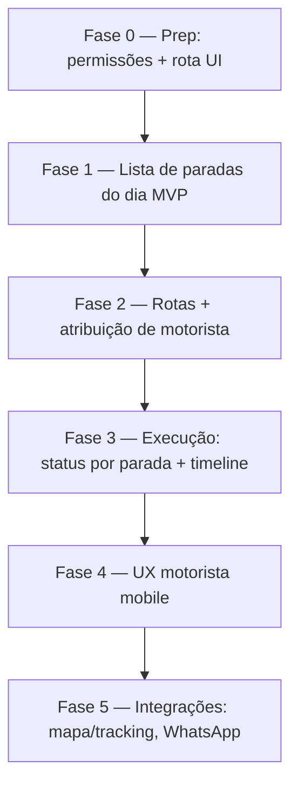

# PetMi Hub — Plano em fases: tela operacional Leva e Traz

Plano de implementação da **operação de transporte de pets (Leva e Traz)** (`/hub/leva-e-traz`), alinhado ao [modelo de domínio](./HUB_DOMAIN_MODEL.md), à integração já existente de rotas de transporte na **agenda** e ao plano de [Banho & Tosa](./HUB_GROOMING_OPERATIONAL_PLAN.md) (a fila B&T já exibe badge L&T).

> **Decisão de produto (jun/2026):** Leva e Traz **permanece no MVP**. A rota `/hub/leva-e-traz` hoje é `HubComingSoonPage` (`apps/hub-web/src/App.tsx`); este documento define o caminho até uma tela operacional de rotas/motorista utilizável.

---

## Estado atual (baseline)

| Item | Situação |
|------|----------|
| Rota `/hub/leva-e-traz` | **Placeholder** (`HubComingSoonPage`) |
| `appointment_kind = 'pickup_route'` | **Existe** (`hubAppointmentsController.ts`) |
| Perna de transporte antes/depois do serviço | **Existe**: `with_pickup_route_before` / `with_pickup_route_after` no payload de agendamento |
| Precificação por km (`pricing_variant.km_tier_index`) | **Existe**: `pickup_route_pricing` + matriz `leva_traz` (`hubServiceTypesPricingMatrix.ts`) |
| Badge L&T na fila de Banho & Tosa | **Existe** (day-board grooming) |
| Modelo de rota/motorista (entidade própria) | **Não existe** (sem `hub_pickup_routes` / `hub_pickup_stops`) |
| Permissões `pickup.*` / motorista | **Não documentadas** ainda (ver proposta abaixo) |

**Princípio herdado:** *appointment (com perna de transporte) = intenção; parada na rota = execução*. O agendamento já cria os registros `pickup_route` (antes/depois); falta a **camada operacional** que agrupa essas pernas em **rotas do dia** e permite ao motorista/recepção acompanhar coletas e entregas.

---

## Princípios de build

1. **Reaproveitar a agenda:** as pernas de transporte já nascem no agendamento (`with_pickup_route_before/after`). A tela L&T **agrega** essas pernas; não recria precificação.
2. **Coleta (pickup) vs entrega (delivery):** `with_pickup_route_before` = buscar o pet (coleta antes do serviço); `with_pickup_route_after` = levar o pet (entrega depois). A tela trata as duas como **paradas** com sentido.
3. **Cobrança nunca automática:** a perna de transporte é uma linha de serviço (`leva_traz`) que entra na comanda/recebível pelo fluxo financeiro padrão; mudar status da parada **não** cria recebível.
4. **MVP sem GPS/tracking:** lista de paradas ordenável + mudança de status manual. Tracking em tempo real e mapa ficam para fase de integrações.
5. **MVP sem app dedicado de motorista:** mesma UI web responsiva (tablet/celular), com permissão restrita.

---

## Permissões propostas (Fase 0)

Adicionar em `backend/src/utils/permissions.ts` (e espelhar em `packages/web-core`):

| Permissão | Descrição | Roles sugeridas |
|-----------|-----------|-----------------|
| `pickup.routes.read` | Ver rotas/paradas do dia | CADMIN, CMANAGER, CASSISTANT, motorista |
| `pickup.routes.manage` | Montar rota, ordenar paradas, atribuir motorista | CADMIN, CMANAGER, CASSISTANT |
| `pickup.stops.update` | Atualizar status de parada (a caminho, coletado, entregue) | + perfil motorista |

> No MVP, motorista pode reutilizar `CASSISTANT` com `pickup.*` namespaced (mesma estratégia de grooming/boarding), até existir role dedicado.

---

## Visão das fases



| Fase | Nome | Objetivo | Release utilizável |
|------|------|----------|-------------------|
| **0** | Preparação | Permissões `pickup.*`, contratos API, esqueleto UI (sai do Coming Soon) | Não (infra) |
| **1** | Lista de paradas MVP | Agregar pernas `pickup_route` do dia em lista única, sem nova tabela | Sim — visão de coletas/entregas do dia |
| **2** | Rotas + motorista | `hub_pickup_routes` + atribuição e ordenação de paradas | Sim — organização do dia |
| **3** | Execução | Status por parada, horários reais, timeline, notas | Sim — operação completa |
| **4** | UX motorista | Mobile-first, «próxima parada», botão ligar/WhatsApp tutor | Sim — polish |
| **5** | Integrações | Mapa/ordenação por distância, tracking, WhatsApp template «a caminho» | Incremental |

---

## Fase 0 — Preparação

### Entregas

1. **Permissões** `pickup.routes.read|manage`, `pickup.stops.update` em `permissions.ts` + espelho na UI.
2. **Rotas backend** — grupo `/api/hub/pickup/*` em `backend/src/modules/hub/routes/index.ts`.
3. **Tipos compartilhados** — `packages/hub-ui/src/api/hubPickupApi.ts`.
4. **Substituir placeholder** em `apps/hub-web/src/App.tsx`: rota `leva-e-traz` → `HubPickupPage` (skeleton).

### Critérios de aceite

- [ ] Usuário com `pickup.routes.read` acessa `/hub/leva-e-traz` (skeleton, não Coming Soon).
- [ ] Usuário sem permissão é redirecionado.
- [ ] PR referencia este documento.

---

## Fase 1 — Lista de paradas do dia MVP

**Objetivo:** a recepção vê todas as coletas e entregas do dia, **sem nova tabela**, lendo as pernas `pickup_route` já criadas pela agenda.

### Backend

1. **`GET /api/hub/pickup/day-board`**:
   - Buscar agendamentos `appointment_kind = 'pickup_route'` (pernas) do dia/unidade, com pet, tutor, endereço, sentido (coleta/entrega), horário e agendamento de origem.
   - Query: `clinic_id`, `unit_id`, `date`/`from`/`to`, `direction` (`pickup` | `delivery` | `all`).
   - Resposta: `{ items, date }`.
2. **Ações via API existente:** `PATCH /api/hub/appointments/:id` para `status` da perna.

### Frontend (`packages/hub-ui`)

| Artefato | Base |
|----------|------|
| `HubPickupPage.tsx` | `HubGroomingQueuePage.tsx` |
| `PickupDayBoard.tsx` | `GroomingQueueBoard.tsx` |
| `hubPickupApi.ts` | `hubGroomingApi.dayBoard` |

- **Abas/filtro:** Coletas / Entregas / Todas.
- **Card mínimo:** pet, tutor, endereço, horário previsto, sentido (ícone coleta/entrega), serviço de origem, status.
- **Colunas (3):** A fazer / Em rota / Concluídas.
- **Refresh:** polling 30s + botão manual.

### Critérios de aceite

- [ ] Lista só pernas L&T do dia da unidade selecionada.
- [ ] Distinguir visualmente coleta de entrega.
- [ ] Link «Ver na agenda» para o agendamento de origem.

---

## Fase 2 — Rotas e atribuição de motorista

### Banco — nova migration (`create_hub_pickup_routes.sql`)

```sql
-- Esboço conceitual (implementar no PR da Fase 2)
hub_pickup_routes (
  id uuid PK,
  clinic_id, unit_id,
  route_date date NOT NULL,
  driver_staff_id,             -- motorista responsável
  vehicle_label text,
  status text NOT NULL,        -- 'planned' | 'in_progress' | 'done' | 'cancelled'
  notes text,
  created_at, updated_at, deleted_at
)

hub_pickup_stops (
  id uuid PK,
  clinic_id,
  hub_pickup_route_id,
  hub_appointment_id,          -- perna pickup_route de origem
  pet_id, guardian_id,
  direction text NOT NULL,     -- 'pickup' | 'delivery'
  address_snapshot jsonb,
  sequence int,                -- ordem na rota
  status text NOT NULL,        -- 'pending' | 'en_route' | 'arrived' | 'completed' | 'failed'
  planned_at, completed_at,
  notes text,
  created_at, updated_at
)
```

### Backend

| Endpoint | Descrição |
|----------|-----------|
| `POST /pickup/routes` | Criar rota do dia + atribuir motorista |
| `POST /pickup/routes/:id/stops` | Adicionar pernas L&T existentes como paradas |
| `PATCH /pickup/routes/:id` | Status da rota, motorista, ordenação (`sequence`) |

### Critérios de aceite

- [ ] Montar rota com N paradas e atribuir um motorista.
- [ ] Reordenar paradas persiste `sequence`.
- [ ] Uma perna `pickup_route` entra em no máximo uma rota ativa.

---

## Fase 3 — Execução

### Backend

- `PATCH /pickup/stops/:id` — `status` por parada (`en_route` → `arrived` → `completed`/`failed`), `completed_at`, notas (`pickup.stops.update`).
- `GET /pickup/routes/:id` — rota com paradas ordenadas + timeline.

### Frontend

- Visão da rota: lista ordenada de paradas com ação rápida de status.
- Timeline da rota (eventos de parada).
- Sincronizar status da perna `hub_appointments` quando a parada concluir (documentar mapeamento no controller).

### Critérios de aceite

- [ ] Atualizar status da parada reflete em < 30s para a recepção (polling).
- [ ] Parada `failed` exige motivo.
- [ ] Concluir entrega do pet sincroniza com a agenda de origem.

---

## Fase 4 — UX motorista (mobile)

- Mobile-first: lista «próxima parada» com endereço e contato.
- Botão **ligar** e **WhatsApp** (link `wa.me` — tier grátis, ver [plano de comunicação](./HUB_COMMUNICATION_WHATSAPP_PLAN.md)).
- Permissão restrita ao motorista (só `pickup.stops.update` + leitura).

### Critérios de aceite

- [ ] Em 390px, o motorista navega a rota e atualiza status com toque.
- [ ] Botão WhatsApp abre conversa com o telefone do tutor (sem custo de API).

---

## Fase 5 — Integrações (contínuo)

| Entrega | Depende de | Notas |
|---------|------------|--------|
| Ordenação por distância / mapa | Geocoding (custo) | Avaliar provedor gratuito antes; fora do MVP |
| Tracking em tempo real | Realtime/infra | Substituir polling |
| WhatsApp «motorista a caminho» | [plano de comunicação](./HUB_COMMUNICATION_WHATSAPP_PLAN.md) | Apenas tier grátis (link `wa.me`) no MVP |
| Cobrança da perna L&T | [HUB_FINANCIAL_MODEL.md](./HUB_FINANCIAL_MODEL.md) | Já é linha `leva_traz`; segue fluxo «Gerar cobrança» |

---

## Critério de sucesso do módulo (release Fase 3)

A equipe consegue, **sem planilha paralela**:

1. Ver todas as coletas e entregas do dia.
2. Montar a rota do dia e atribuir um motorista.
3. Acompanhar o status de cada parada em tempo quase real.
4. Concluir coleta/entrega sincronizada com a agenda e o financeiro.

---

## Referências de código

| Área | Arquivo |
|------|---------|
| Perna de transporte no agendamento | `backend/src/modules/hub/hubAppointmentsController.ts` (`with_pickup_route_before/after`, `pickup_route_pricing`) |
| Matriz de preço `leva_traz` | `backend/src/modules/hub/hubServiceTypesPricingMatrix.ts` |
| Badge L&T na fila B&T | `backend/src/modules/hub/hubGroomingController.ts` |
| Padrão de day-board (UI) | `packages/hub-ui/src/pages/grooming/GroomingQueueBoard.tsx` |
| Rota placeholder | `apps/hub-web/src/App.tsx` → `leva-e-traz` |

---

## Status de implementação

| Fase | Status |
|------|--------|
| 0 — Permissões + rota UI | **Concluído** (jun/2026) |
| 1 — Lista de paradas MVP | **Concluído** (jun/2026) |
| 2 — Rotas + motorista | Pendente |
| 3 — Execução | Pendente |
| 4 — UX motorista mobile | Pendente |
| 5 — Integrações | Pendente |

*Última atualização: jun/2026 — Fases 0 e 1 implementadas.*
