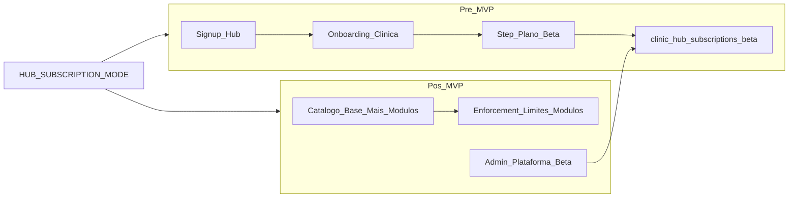

# Planos de assinatura do Hub — Beta (MVP) e catálogo pós-MVP

**Estado:** Fase 1 (pré-MVP) implementada no código — executar migration `082` no Supabase.

Plano de implementação da assinatura SaaS do PetMi Hub (o que a clínica/petshop paga para usar o produto). Distinto de **pacotes de serviço** (`hub_packages`), que são vendidos pelo negócio ao tutor.

Referências: [PERMISSIONS_ROADMAP.md](./PERMISSIONS_ROADMAP.md) (entitlements `module.*`), [PRODUCT_BOUNDARIES.md](./PRODUCT_BOUNDARIES.md) (billing base em `platform`), [HUB_SIGNUP_FIRST_ADMIN_AND_UNIT.md](./HUB_SIGNUP_FIRST_ADMIN_AND_UNIT.md) (onboarding).

Plano executável com todos: [`.cursor/plans/planos_hub_beta.plan.md`](../../.cursor/plans/planos_hub_beta.plan.md)

---

## Contexto e decisões de produto

- **Organização** = tabela `clinics` (já existente).
- **Pacotes Hub** (`hub_packages`, `hub_subscriptions`) são billing **cliente final** — não misturar com SaaS.
- Tabelas legadas `plans` / `clinic_subscriptions` são do Vet, sem uso no backend — **não reutilizar**; criar schema Hub dedicado em `petimi_hub/`.
- Modelo comercial:
  - **Plano base** = capacidade (unidades, usuários)
  - **Adicionais** = módulos operacionais (`clinic`, `grooming`, `boarding`)
  - **Beta** = override de cobrança + acesso total, gerenciado **somente pelo admin da plataforma** (`/admin`)

---

## Fase 1 — Pré-MVP

Antes do lançamento comercial: cadastro mostra **apenas o plano Beta** (acesso total, grátis, sem cartão).

### Schema

Migration `082_create_hub_platform_subscriptions.sql`:

| Tabela | Propósito |
|--------|-----------|
| `hub_platform_plans` | Catálogo base (`beta`, `solo`, `growth`, `network`) |
| `hub_platform_modules` | Adicionais (`hub_core`, `clinic`, `grooming`, `boarding`) |
| `clinic_hub_subscriptions` | Assinatura ativa por clínica |

Campos beta em `clinic_hub_subscriptions`: `is_beta`, `beta_free_until`, `beta_discount_percent`, `override_monthly_cents`, `beta_notes`, `enabled_modules`.

### Backend

- `hubSubscriptionService.ts` — criar/ler assinatura, `organizationHasModule`
- Hook em `postHubOnboardingClinic` → `createBetaSubscription(clinicId)`
- `getHubSessionContext` retorna `subscription` no payload
- `HUB_SUBSCRIPTION_MODE=beta_only` (default) | `catalog` (pós-MVP)
- `GET /api/hub/subscription/plans`

### Frontend Hub

Wizard de onboarding: Organização → Unidade → **Plano Beta** (card único, aceite de termos).

### Admin plataforma

`PATCH /api/admin/clinics/:clinicId/subscription` — editar beta, data limite, módulos, notas.

### Enforcement pré-MVP

Nenhum bloqueio de funcionalidade. Apenas garantir registro de assinatura + backfill de clínicas existentes.

---

## Fase 2 — Pós-MVP

Ativar com `HUB_SUBSCRIPTION_MODE=catalog`.

### Catálogo no onboarding

- **Plano base:** Solo / Crescimento / Rede
- **Módulos:** Clínica, Banho & Tosa, Hotel & Creche (checkboxes)
- Pacotes sugeridos como atalhos UI (Petshop, Clínica, Completo)

### Enforcement

| Ação | Checagem |
|------|----------|
| Criar unidade | `count(units) < max_units` |
| Convidar staff | `count(clinic_users) < max_users` |
| Rotas/menus de módulo | `organizationHasModule(clinic, module)` |

Regra: `hasPermission(user, perm) AND organizationHasModule(org, module)`.

### Migração Beta → pago

Grace period, notificação, cobrança manual inicial (sem gateway no primeiro release pós-MVP).

### UI clínica (read-only)

CADMIN vê plano e módulos ativos; upgrade via contato.

### Cobrança (fase posterior)

Asaas/Iugu/Stripe + webhooks para `status`.

---

## Mapeamento módulo → produto

| Módulo | Entitlement | Sidebar |
|--------|-------------|---------|
| `hub_core` | `module.hub_core` | Agenda, Clientes, Caixa |
| `clinic` | `module.clinic` | Clínica |
| `grooming` | `module.grooming` | Banho & Tosa |
| `boarding` | `module.boarding` | Hotel & Creche |

---

## Ordem de implementação

1. Migration + seeds
2. `hubSubscriptionService` + hook no onboarding
3. Session context + backfill
4. UI step Beta no onboarding
5. Admin plataforma para beta
6. (Pós-MVP) Catálogo, enforcement, sidebar gating
