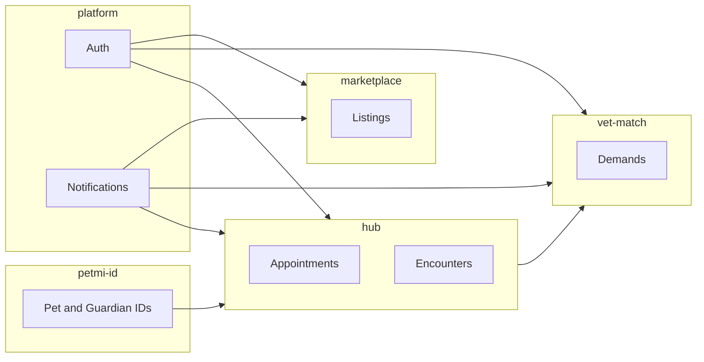

# Fronteiras de produto — PetiMiUniverse

Este documento define **o que pertence a cada domínio**, quem é dono dos dados e como os produtos se conversam. Objetivo: evitar acoplamento acidental (ex.: lógica de staffing dentro do core operacional do Hub).

## Visão geral

| Domínio | Nome em código | Responsabilidade principal |
|---------|----------------|----------------------------|
| Platform | `platform` | Auth, identidade de usuário, RBAC base, notificações transversais, auditoria, storage, billing base, analytics base |
| PetMi ID | `petmi-id` | Identificadores estáveis e portáveis (pet, tutor, profissional, org), consentimento e compartilhamento de histórico |
| PetMi Hub | `hub` | Operação do negócio pet: agenda, pets/tutores, atendimentos, multi-unidade, filas operacionais, financeiro simples, dashboard operacional |
| PetMi Vet / Match (staffing) | `vet-match` | Demandas, posições, aplicações, convites, work proof, matching clínica ↔ profissional |
| Marketplace | `marketplace` | Listagens B2B/B2C de itens, mensagens de listing, reputação comercial ligada a transações (não prontuário) |
| Admin da plataforma | `admin` | Moderação, aprovações globais, relatórios de sistema, suporte |

Produtos futuros (ex.: **PetMi Match adoção**, app **tutor**) consomem **platform** + **petmi-id** + APIs específicas; não duplicam org/unidade do Hub sem decisão explícita.

---

## 1. Platform (`platform`)

### Inclui

- Autenticação (Supabase Auth) e sessão.
- Resolução de perfil (vet, freelancer, staff de clínica, futuro tutor).
- **Identidade é platform-level** (um único projeto Supabase); a **sessão UX é por origem de browser** — Hub e Vet armazenam sessão separada no `localStorage` de cada domínio. Usuários autenticam-se independentemente em cada app; não há handoff de sessão entre origens por design.
- Infraestrutura de notificações (canal, templates, deduplicação).
- Audit log de ações sensíveis.
- Upload/armazenamento de arquivos (políticas por contexto).
- Feature flags / entitlements por organização (quando implementado).
- Webhooks e integrações genéricas (ex.: pagamento, WhatsApp) como **conectores**, não regras de negócio de módulo.

### Não inclui

- Regras de agenda, fila de banho, internação ou prescrição.
- Publicação de demandas ou aprovação de plantão.

### Interfaces

- Expõe: autenticação, `user_id`, contexto de organização ativa, permissões efetivas.
- Consome: nada de domínio de produto além de metadados para roteamento.

---

## 2. PetMi ID (`petmi-id`)

### Inclui

- **PetMi Pet ID**: identificador global do pet (pode mapear para UUID interno).
- **Guardian / tutor** como entidade de plataforma (ligação com `auth.users` quando aplicável).
- Políticas de **compartilhamento** (quem pode ver vacinas, alergias, documentos).
- **Linha do tempo lógica** do pet como agregação de eventos de produtos (visão read-model).

### Inclui explicitamente (futuro)

- Portabilidade de histórico entre empresas do ecossistema mediante consentimento.
- Documentos e certificados com assinatura/verificação.

### Não inclui

- Agendamento operacional (isso é Hub).
- Matching de profissionais (vet-match).

### Dono dos dados

- PetMi ID é **dono da identidade do pet e do vínculo tutor–pet** na plataforma.
- Hub e Clinic escrevem **eventos e fatos clínicos/operacionais**; ID governa identidade e visibilidade.

---

## 3. PetMi Hub (`hub`)

### Inclui

- **Organização** do negócio pet (hoje mapeável a `clinics`; evolução para `organizations` se necessário).
- **Unidades** (`units`), equipe (`clinic_users` / futuro `staff_members`).
- **Agenda** unificada (consulta, banho, hotel, retorno).
- **Cadastro operacional** de tutores e pets (CRM operacional; alinhado a PetMi ID).
- **Onboarding de organização (futuro):** o Hub pode passar a ser o lugar onde uma nova clínica/negócio completa o **cadastro da pessoa administradora** e, em seguida, a **primeira unidade** — em vez de um único formulário “só empresa + e-mail” herdado do Vet. Ver [HUB_SIGNUP_FIRST_ADMIN_AND_UNIT.md](./HUB_SIGNUP_FIRST_ADMIN_AND_UNIT.md) (backlog, não implementado).
- **Atendimento / encounter**: check-in, execução, check-out, status.
- **Timeline operacional** do pet na unidade (e agregação para visão ID).
- **Financeiro simples**: cobrança, status de pagamento, recibo.
- **Dashboard operacional** da unidade (ocupação, fila, KPIs operacionais).
- Módulos plugáveis: **Grooming**, **Hotel/Daycare**, **Clinic** (camadas que estendem encounter, não substituem org/pet).

### Não inclui

- Modelo completo de marketplace de itens.
- Fluxo de `demand` / `application` / work proof (delegado a vet-match).

### Dependências

- **platform**: auth, notificações, storage.
- **petmi-id**: identidade estável de pet/tutor e consentimento.

---

## 4. PetMi Vet / Match — Staffing (`vet-match`)

### Inclui

- `demands`, `demand_positions`, aplicações (incluindo modelos legados e unificados), convites, conflitos.
- **Work proof**: check-in/out do plantão, relatório do shift.
- UX e APIs para vet/freelancer/clínica no ciclo de contratação temporária.

### Não inclui

- Dono exclusivo de **unidade** ou **cadastro de pet do cliente final** (usa Hub/platform).
- Prontuário clínico completo (Hub + módulo Clinic).

### Dependências

- **hub** (ou org/unidade via platform): contexto de qual unidade publica demanda; permissões de staff.
- **platform**: notificações, audit.

---

## 5. Marketplace (`marketplace`)

### Inclui

- Listagens, busca, mensagens entre comprador/vendedor no contexto do listing.
- Regras de `seller_type` / `seller_id` e moderação associada.

### Não inclui

- Agenda de serviços do Hub (exceto integrações explícitas tipo “comprar pacote” → gera compromisso no Hub).
- Dados clínicos.

### Dependências

- **platform**: auth, notificações.
- **hub** (opcional): vínculo “compra gera serviço agendado”.

---

## 6. Admin (`admin`)

### Inclui

- Aprovação de clínicas, unidades, vets, freelancers.
- Relatórios globais, suporte, ferramentas de diagnóstico.
- Políticas de plataforma (ban, fraude).

### Não inclui

- Operação diária de uma unidade (Hub).

---

## Matriz de comunicação (alto nível)

## Regras anti-interferência

1. **Nenhum import cruzado** de UI de vet-match dentro de telas core do Hub sem passar por contrato (rota lazy, package boundary ou feature module).
2. **Tipos de notificação** prefixados ou namespaced: `hub.*`, `vet_match.*`, `marketplace.*`, `platform.*`.
3. **Tabelas novas** devem ter owner documentado neste arquivo antes do merge.
4. **Estatísticas**: métricas por produto; payloads agregados devem declarar origem (`hub`, `vet_match`, etc.).

---

## Governança

- Alterações que **atravessem** duas fronteiras exigem atualização deste documento + revisão de `PERMISSIONS_ROADMAP.md`.
- Nome de marca em código: preferir prefixo estável `petimi` ou `petmi` em pacotes futuros; alinhar com decisão de produto em `HUB_MVP_EPICS.md` (Fase 0).
